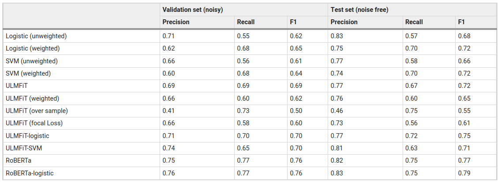

```{r setup, include=FALSE}
knitr::opts_chunk$set(echo = FALSE)
library(reticulate)
library(quanteda)
library(lexicon)
use_virtualenv("~/software/py39")
library(dplyr)
library(ggplot2)
```


```{python include=FALSE}
import math
import pandas as pd
import matplotlib.pyplot as plt
from matplotlib.colors import Normalize
import numpy as np

def plot_heatmap(X, xlabs, ylabs):
    # Plot a heatmap of the dfm
    fig, ax = plt.subplots()
    ax.imshow(
        X,
        cmap = "Greys",
        norm = Normalize(vmin=0, vmax=X.max()*2)
    )

    # Create a grid using minor ticks
    ax.set_xticks(np.arange(X.shape[1])+0.5, minor=True)
    ax.set_yticks(np.arange(X.shape[0])+0.5, minor=True)
    ax.grid(which="minor", zorder=5)

    # Set up x labels
    ax.xaxis.tick_top()
    ax.set_xticks(np.arange(X.shape[1]))
    ax.set_xticklabels(xlabs, rotation=60, ha="left", va="bottom")

    # Set up y labels
    ax.set_yticks(range(len(ylabs)))
    ax.set_yticklabels(ylabs)

    # Put the numbers in
    for m in range(X.shape[0]):
        for n in range(X.shape[1]):
            ax.text(n, m, f"{X[m, n]:.2f}", ha="center", va="center")
            
plt.show()
```

# Introduction and Objectives

## Assignment 2

Assignment 2 is due tonight. I am looking forward to receiving your submissions.

## Objectives

Last week we asked if a text was **positive** or **negative** in sentiment.

This question is a special case of a common classification problem. Is a text X? Is it Y?

We will look at variants of this question and how to answer these by *training* a machine learning model to reproduce a given set of labels

# Classification

## (Re-)Introduction to classification

Classification is when we want to know if a given label or (labels) applies to a text.

Recall our first practical session where we built a rudimentary spam filter. We were looking for a functional form which allowed us to predict spam-ness as a function of our features.

\medskip
\scriptsize

```{python echo=TRUE, include=TRUE, message=FALSE}
from sklearn.feature_extraction.text import CountVectorizer
texts = [
    "Win cash", "free money", "free cash","cash money",
    "Thank you", "Best wishes","Cheers mate"
]
spam = [1,1,1,1,0,0,0]

vec = CountVectorizer()
dfmat = vec.fit_transform(texts)
pd.DataFrame(dfmat.todense(),columns=vec.get_feature_names_out(), index=texts)
```

## (Re-)Introduction to classification

A very simple way of finding this functional form is via logistic regression

\medskip
\scriptsize

```{python echo=TRUE, include=TRUE, message=FALSE}
from sklearn.linear_model import LogisticRegression
clf = LogisticRegression()
clf.fit(dfmat, spam)
print(clf.intercept_)
coefs = dict(zip(
  vec.get_feature_names_out(),
  clf.coef_.ravel().round(2)
))
coefs
```


## (Re-)Introduction to classification

We can just add up the intercept and the coefficients, and apply a sigmoid function to this score .

\[ t = \beta_0 + \beta_1X_1 + \cdots + \beta_kX_k\]
\[p(X) = \sigma(t)\]

\medskip
\scriptsize

```{python echo=TRUE, include=TRUE, message=FALSE}
from scipy.stats import logistic

print(logistic.cdf(clf.intercept_ + coefs["cash"]))

clf.predict_proba(vec.transform(["cash please"])).round(2)
```

\normalsize

By *fitting* the logistic regression model, we have found a functional form which minimises a loss function (distance between predictions and reality)

## Classification in a nutshell

Some would say we've done machine-learning again!

No matter how much fancier we get than logistic regression, the steps stay the same

\begin{enumerate}
  \item<1->Turn texts into features
  \item<2->Specify a model type
  \item<3->\textit{Fit} a model on our features and response value
  \item<4->Using our fitted model, we can make predictions for any new text \textit{in the same feature space}
\end{enumerate}


## Types of classification problems

So far we have explored simple binary classification tasks. In fact, we have three types

- **Binary classification**: Is a text spam OR not-spam
- **Multiclass classification**: Is a text written by Labour or the Conservatives or the Liberal Democrats (choose exactly one)
- **Multilabel classification**: Is a text about climate impacts or climate mitigation or climate adaptation (choose 0 or more). 

The principle will remain the same, but we'll have to make a few changes to how we represent the problem. Pay particular attention to the difference between the last 2.

# Measuring success

## Training and validating

To evaluate a certain model, we train it on some data, and validate it on some **other** data.

To validate a model on **other** data means to use the features to make predictions for that data, then compare the predictions to the true values for our response variable.

It is **very** important that data does not **leak** from training to validation.

We want to understand not just how well a model fits the data it is trained on, but also how well this **generalises** to other similar data.

## Metrics for classification tasks

Given a binary variable, when we compare the value of $y$ with $\hat{y}$ (or `y_true` with `y_pred`), we can have 4 outcomes

- True positive (TP) - $y=1 \;\;\;\;\; \hat{y}=1$
- True negative (TN) - $y=0 \;\;\;\;\; \hat{y}=0$
- False positive (FP) - $y=0 \;\;\;\;\; \hat{y}=1$
- False negative (FN) - $y=1 \;\;\;\;\; \hat{y}=0$

A perfect classifier contains *only* **true positives** and **true negatives**.

Most validation metrics are various ways to count these up


## Accuracy

Accuracy is simply the number of right decisions divided by the total number of decisions we make

\[\frac{TP+TN}{TP+TN+FP+FN}\]

It is bounded between 0 (every single decision was wrong), and 1 (every single decision was right).

It is the easiest metric to understand, but it can be misleading when data is unbalanced (which it mostly is)

## Misleading Accuracy

Let's consider the case where 90% of emails are **not spam**. We can achieve an accuracy of 90% simply by always predicting 0.

```{r echo=TRUE, include=TRUE, message=FALSE}
y_true <- c(0,1,0,0,0,0,0,0,0,0)
y_pred <- c(0,0,0,0,0,0,0,0,0,0)
correct <- sum(y_true==y_pred)
accuracy <- correct/length(y_true)
accuracy
```
Despite an impressive accuracy score, this classifier is not useful at all

## Recall (sensitivity)

Recall (sometimes called sensitivity) measures something much more specific: 

\ 

> the proportion of truly positive samples we find by using our classifier 

Formally, this is given by

\[ \frac{TP}{TP+FN}\]

\scriptsize

```{r echo=TRUE, include=TRUE, message=FALSE}
tp <- sum((y_true==1)&(y_pred==1))
fn <- sum((y_true==1)&(y_pred==0))
recall <- tp / (tp+fn)
recall
```

## Precision

Precision, on the other hand, refers to 

\ 

> the proportion of positive predictions which are truly positive

This is given by

\[ \frac{TP}{TP+FP}\]

\scriptsize

```{r echo=TRUE, include=TRUE, message=FALSE}
tp <- sum((y_true==1)&(y_pred==1))
fp <- sum((y_true==0)&(y_pred==1))
precision <- tp / (tp+fp)
precision
```

If we make zero positive predictions, we can't calculate precision.

## F1 score

The F1 score is the harmonic (balanced) mean of precision and recall. It also ranges between 1 (perfect) and 0 (perfectly bad) but it is not so misleading given unbalanced data

\medskip

Let's make a random 90% of our predictions correct, and flip the other 10%

\medskip

\scriptsize
```{r echo=TRUE, include=TRUE, message=FALSE}
accuracy_target <- 0.9

p = rep(1,100)
n = rep(0,900)
y <- sample(c(p,n))
y_pred <- y
perturb <- round(length(y)*(1-accuracy_target))
y_pred[1:perturb] <- 1 - y_pred[1:perturb]
tp <- sum((y==1)&(y_pred==1))
fn <- sum((y==1)&(y_pred==0))
fp <- sum((y==0)&(y_pred==1))
tn <- sum((y==0)&(y_pred==0))

recall <- tp / (tp+fn)
precision <- tp / (tp+fp)
f1 <- mean(c(recall,precision))
acc <- (tp+tn)/(tp+tn+fp+fn)
sprintf("Precision: %f, recall: %f, f1: %f, accuracy: %f", precision, recall, f1, acc)
```

## Thresholds

The sigmoid function gives us score between 0 and 1. We usually treat 0.5 as a threshold, where everything above it belongs to the class and everything below it does not. However, we can adjust this threshold

:::::: {.cols data-latex=""}

::: {.col data-latex="{0.5\textwidth}"}
\scriptsize

```{r echo=TRUE, include=TRUE, message=FALSE}
library(stats)
library(dplyr)

n <- 1000
t <- rlogis(n, location=qlogis(0.1))
noise <- rnorm(n,sd=0.5)
y <- plogis(t)
y_pred <- plogis(t+noise)

df <- data.frame(y=y,y_pred=y_pred) %>%
  arrange(y)

png("plots/thresholds.png")
plot(df$y)
points(df$y_pred, col="red")
abline(v=which(df$y>0.5)[1])
abline(h=0.5)
dev.off()
```
:::

::: {.col data-latex="{0.05\textwidth}"}
\ 
:::

::: {.col data-latex="{0.45\textwidth}"}

\begin{figure}
\includegraphics[width=\linewidth]{plots/thresholds.png}
\end{figure}

:::

::::::


## Precision-recall tradeoff

Adjusting the threshold therefore gives us different values of precision and recall 

:::::: {.cols data-latex=""}

::: {.col data-latex="{0.5\textwidth}"}
\scriptsize

```{r echo=TRUE, include=TRUE, message=FALSE, fig.show="hide"}
library(ggplot2)
df <- data.frame(t=numeric(), p=numeric(), r=numeric())
for (thresh in seq(0,1,0.01)) {
  tp <- sum((y>=0.5)&(y_pred>=thresh))
  fn <- sum((y>=0.5)&(y_pred<=thresh))
  fp <- sum((y<=0.5)&(y_pred>=thresh))
  recall <- tp / (tp+fn)
  precision <- tp / (tp+fp)
  df <- df %>% add_row(t=thresh, p=precision, r=recall)
}
ggplot(df, aes(r, p, colour=t)) +
  geom_point()
ggsave("plots/precision-recall.png", width=5, height=4)
```
:::

::: {.col data-latex="{0.05\textwidth}"}
\ 
:::

::: {.col data-latex="{0.45\textwidth}"}

\begin{figure}
\includegraphics[width=\linewidth]{plots/precision-recall.png}
\end{figure}

:::

::::::

## Precision-recall tradeoff

The maximum value of f1 does not necessarily lie at a threshold of 0.5 (be aware this is entirely synthetic data!)

:::::: {.cols data-latex=""}

::: {.col data-latex="{0.5\textwidth}"}
\scriptsize

```{r echo=TRUE, include=TRUE, message=FALSE, fig.show="hide"}
library(ggplot2)

df$f1 <- (df$p + df$r) / 2

ggplot(df, aes(t, f1)) +
  geom_point()
ggsave("plots/threshold-f1.png", width=5, height=4)
```
:::

::: {.col data-latex="{0.05\textwidth}"}
\ 
:::

::: {.col data-latex="{0.45\textwidth}"}

\begin{figure}
\includegraphics[width=\linewidth]{plots/threshold-f1.png}
\end{figure}

:::

::::::

## Specificity

Specificity, also known as the **true negative rate** tells us:

\ 

> What proportion of non-spam emails were correctly identified as not-spam

and it is given by 

\[ \frac{TN}{TN+FP}  \]

It's inverse, the **false positive rate**, tells us the probability of a false alarm.

## ROC-AUC

Like precision, the false positive rate trades off against recall (sensitivity). The curve we get by examining this tradeoff at different thresholds is also called the Receiver operating characteristic (after its use in radar systems).

:::::: {.cols data-latex=""}

::: {.col data-latex="{0.5\textwidth}"}
\scriptsize

```{r echo=TRUE, include=TRUE, message=FALSE, fig.show="hide"}
library(ggplot2)
df <- data.frame(t=numeric(), tpr=numeric(), fpr=numeric())
for (thresh in seq(0,1,0.01)) {
  tp <- sum((y>=0.5)&(y_pred>=thresh))
  fn <- sum((y>=0.5)&(y_pred<=thresh))
  fp <- sum((y<=0.5)&(y_pred>=thresh))
  tpr <- tp / (tp+fn)
  fpr <- fp / (fp+tn)
  df <- df %>% add_row(t=thresh, tpr=tpr, fpr=fpr)
}
ggplot(df, aes(fpr, tpr, colour=t)) +
  geom_point()
ggsave("plots/roc.png", width=5, height=4)
```
:::

::: {.col data-latex="{0.05\textwidth}"}
\ 
:::

::: {.col data-latex="{0.45\textwidth}"}

\begin{figure}
\includegraphics[width=\linewidth]{plots/roc.png}
\end{figure}

:::

::::::

## ROC-AUC

You can calculate the area under the curve, which is known as the ROC-AUC score

:::::: {.cols data-latex=""}

::: {.col data-latex="{0.5\textwidth}"}

The ROC-AUC score tells us the probability that a randomly selected positive instance will be ranked higher than a randomly selected negative instance.

- ROC-AUC==1: the classifier is perfect
- ROC-AUC==0.5: the classifier is as good as random chance
- ROC-AUC<0.5: the classifier is worse than random chance

\scriptsize

```{r echo=TRUE, include=TRUE, message=FALSE, fig.show="hide"}

library(ModelMetrics)
auc(round(y),y_pred)

```
:::

::: {.col data-latex="{0.05\textwidth}"}
\ 
:::

::: {.col data-latex="{0.45\textwidth}"}

\begin{figure}
\includegraphics[width=\linewidth]{plots/roc.png}
\end{figure}

:::

::::::

## Training, validation, and test splits

Any validation metric tells us how good a particular instance of a model performs in predicting the right labels for a particular set of documents it has not seen.

In practice, we want to do two things:

- Select a model which we think works best (by validating)
- Evaluate this best model on another set of data that has never been seen before

This gives us an estimate of how well our **best** model might perform on new data.

This means we **first** split our data into a training and a test split, and hold this test split back entirely. We must never use it to make decisions, but only to estimate performance of our chosen model.

We can further split our training set into further training and validation sets in order to make decisions about which model is best.

# Training a model

## Data

We're going to take our UK manifestos again, and use the annotations provided as labels. The label 501 is used to describe Environmental Protection [source](https://manifesto-project.wzb.eu/coding_schemes/mp_v5). We'll see if we can predict this label using machine learning.

As a first step, we can create a dummy variable for environmental protection, and look at how its distributed. 

:::::: {.cols data-latex=""}

::: {.col data-latex="{0.5\textwidth}"}
\scriptsize

```{python echo=TRUE, include=TRUE, message=FALSE, fig.show="hide"}
import pandas as pd
import numpy as np
fig, ax = plt.subplots(figsize=(4,3))
df = pd.read_csv("../datasets/uk_manifestos.csv")
df["env"] = np.where(df["cmp_code"]==501,1,0)
df.groupby(["env"])["text"].count().plot.bar(ax=ax)
plt.savefig(
  "plots/env_text_count.png", bbox_inches="tight"
)
```

:::

::: {.col data-latex="{0.05\textwidth}"}
\ 
:::

::: {.col data-latex="{0.45\textwidth}"}

\begin{figure}
\includegraphics[width=\linewidth]{plots/env_text_count.png}
\end{figure}

:::

::::::

## Loading the data in R

```{r echo=TRUE, include=TRUE, message=FALSE, fig.show="hide"}
library(readr)
library(tidyr)
library(dplyr)
df <- read_csv("../datasets/uk_manifestos.csv")
df<- df[sample(nrow(df)),]
df$env <- 0
df$env[df$cmp_code==501] <- 1
df$env <- factor(df$env) 
```

## Setting up a pipeline

Now we want to set up a pipeline that describes all the steps from data into predictions. This includes our usual vectorizer, then a Support Vector Machine classifier. These work by trying to fit a hyperplane that best separates the data in our multidimensional feature space.

\medskip
\scriptsize

```{python echo=TRUE, include=TRUE, message=FALSE, fig.show="hide"}
from sklearn.pipeline import Pipeline
from sklearn.svm import SVC
from sklearn.feature_extraction.text import TfidfVectorizer
clf = Pipeline(
    steps=[
        ("vect", TfidfVectorizer()),
        ("clf", SVC(probability=True, class_weight="balanced")),
    ]
)
```

## Splitting train and test data

Now we split our data into train and test sets, and we can try fitting our pipeline on the training data. Once this is fit, we can make predictions on any new text data

\medskip
\scriptsize

```{python echo=TRUE, include=TRUE, message=FALSE, fig.show="hide"}
from sklearn.model_selection import train_test_split
X_train, X_test, y_train, y_test = train_test_split(
    df.text, df.env, test_size=0.2, random_state=42)

clf.fit(X_train, y_train)
clf.predict_proba([
    "We will not raise taxes",
    "We will protect our natural resources"
])
```

## Evaluating our model

Now we can evaluate the model on our test data. Although the accuracy is quite good, our F1 score is not wonderful.

\medskip
\scriptsize

```{python echo=TRUE, include=TRUE, message=FALSE, fig.show="hide"}
from sklearn.metrics import f1_score, accuracy_score, precision_score, recall_score, roc_auc_score

y_pred = clf.predict_proba(X_test)

roc_auc = roc_auc_score(y_test, y_pred[:,1])
recall = recall_score(y_test, y_pred[:,1].round())
prec = precision_score(y_test, y_pred[:,1].round())
acc = accuracy_score(y_test, y_pred[:,1].round())
f1 = f1_score(y_test, y_pred[:,1].round())

print(f"ROC-AUC: {roc_auc:.1%}, Accuracy: {acc:.1%}, Precision: {prec:.1%}, recall: {recall:.1%}, F1 score: {f1:.1%}")
```

## Writing a Rrecipe

In the tidymodels ecosystem in R, a pipeline is called a "recipe"/"workflow"

\medskip
\scriptsize

```{r echo=TRUE, include=TRUE, message=FALSE, fig.show="hide"}
library(tidymodels)
library(textrecipes)

df_split <- initial_split(df, prop=0.8)
train_data <- training(df_split)
test_data <- testing(df_split)

rec <-recipe(env ~ text, data = train_data) %>%
  step_tokenize(text) %>%
  step_tokenfilter(text, max_tokens = 1e3) %>%
  step_tfidf(text)

model <- svm_linear(mode="classification")

wf <- workflow() %>%
  add_recipe(rec) %>%
  add_model(model)

model_fit <- wf %>% 
  fit(train_data)
```


## Evaluating our model

Now we can evaluate the model on our test data. Although the accuracy is quite good, our F1 score is not wonderful.

\medskip
\scriptsize

```{r echo=TRUE, include=TRUE, message=FALSE, fig.show="hide"}
test_data$prediction <- predict(model_fit, test_data)$.pred_class

scorer <- metric_set(
  yardstick::accuracy, 
  yardstick::precision, 
  yardstick::recall,
  yardstick::f_meas
)

scorer(test_data, truth=env, estimate=prediction, event_level="second")
```

# Optimizing and selecting a model

## Tuning hyperparamters

There are a lot of different choices we can make in how we set up our model, and we can try out the effect of each of these, across 5 further splits of the training data. This takes quite a bit of time, so the set of parameter choices in the example is very small

\medskip
\scriptsize

```{python echo=TRUE, include=TRUE, message=FALSE, fig.show="hide"}
from sklearn.model_selection import GridSearchCV

parameters = [
    {
        'vect__max_df': (0.5,),
        'vect__min_df': (5,),
        #'vect__ngram_range': ((1, 1), (1, 2)),  
        'clf__kernel': ['linear'], 
        #'clf__C': [1, 1e2]
    }
]

grid_search = GridSearchCV(
  clf, parameters, scoring="f1", n_jobs=4, verbose=1, cv=2
)
grid_search.fit(X_train, y_train)
```

## The spread of performance across hyperparameters

The results of each model specification are stored in .cv_results_ - we can quickly look at the spread of f1 scores across specifications

:::::: {.cols data-latex=""}

::: {.col data-latex="{0.5\textwidth}"}
\scriptsize
```{python echo=TRUE, include=TRUE, message=FALSE}
res = (pd.DataFrame(grid_search.cv_results_)
  .sort_values("rank_test_score",ascending=True)
)
hist = plt.hist(res["mean_test_score"])
res.head()
# The plot on the right -> comes from a wider 
# search we carried out in the notebook
```

:::

::: {.col data-latex="{0.05\textwidth}"}
\ 
:::

::: {.col data-latex="{0.45\textwidth}"}

\begin{figure}
\includegraphics[width=\linewidth]{plots/hyperparam.png}
\end{figure}

:::

::::::

\medskip
\scriptsize

## Testing tuned hyperparameters

Now we can test the model specification that performed best in our tuning procedure on our test dataset (which it has *not* seen before)

\medskip
\scriptsize

```{python echo=TRUE, include=TRUE, message=FALSE, fig.show="hide"}
y_pred = grid_search.predict_proba(X_test)

roc_auc = roc_auc_score(y_test, y_pred[:,1])
recall = recall_score(y_test, y_pred[:,1].round())
prec = precision_score(y_test, y_pred[:,1].round())
acc = accuracy_score(y_test, y_pred[:,1].round())
f1 = f1_score(y_test, y_pred[:,1].round())

print(f"ROC-AUC: {roc_auc:.1%}, Accuracy: {acc:.1%}, Precision: {prec:.1%}, recall: {recall:.1%}, F1 score: {f1:.1%}")
```
## Tuning hyperparameters in R

We can tune hyperparaters using the tune package in R. We say what parameters we want to tune, add this to a workflow, define the folds, and then apply `tune_grid()` to our workflow

\medskip
\scriptsize

```{r echo=TRUE, include=TRUE, message=FALSE, fig.show="hide", cache=TRUE}
model <- svm_poly(cost=tune()) %>%
  set_engine("kernlab") %>%
  set_mode("classification")

wf <- workflow() %>%
  add_recipe(rec) %>%
  add_model(model)

folds <- vfold_cv(train_data, v = 2)
svm_res <- tune_grid(
  wf, resamples = folds, grid = 2,
  metrics = metric_set(f_meas),
  control = control_grid(event_level="second")
  )
collect_metrics(svm_res)
```

## Testing our best model

We then select our best model, and add finalise our workflow with this model

\medskip
\scriptsize

```{r echo=TRUE, include=TRUE, message=FALSE, fig.show="hide", cache=TRUE}
best_model <- svm_res %>% select_best()

final_workflow <- wf %>% 
  finalize_workflow(best_model)

final_model <- final_workflow %>%
  fit(train_data)

test_data$opt_prediction <- predict(final_model, test_data)$.pred_class
scorer(test_data, truth=env, estimate=opt_prediction, event_level="second")
```

## Threshold tuning

The fact that there is a large spread between precision and recall, and that ROC-AUC is much better than F1, indicates we may have a less than optimal threshold. Across 5 train-test splits of our train data, we can try out different thresholds using our best model.

\medskip
\scriptsize

```{python echo=TRUE, include=TRUE, message=FALSE, fig.show="hide"}
X_train = X_train.reset_index(drop=True)
y_train = y_train.reset_index(drop=True)

res = []

from sklearn.model_selection import KFold
kf = KFold(n_splits=5, random_state=None, shuffle=False)
k = 0
for train_index, test_index in kf.split(X_train):
    clf = grid_search.best_estimator_
    clf.fit(X_train[train_index], y_train[train_index])
    y_pred_k = clf.predict_proba(X_train[test_index])
    for t in np.linspace(0.1, 0.9, 50):
        y_pred_bin = np.where(y_pred_k[:,1]>t,1,0)
        res.append({
            "t": t, 
            "f1": f1_score(y_train[test_index], y_pred_bin),
            "k": k
        })
    k+=1
    
res = pd.DataFrame(res)
```

## Threshold tuning

\medskip
\scriptsize

```{python echo=TRUE, include=TRUE, message=FALSE, fig.show="hide"}
optimal_t = res.groupby("t")["f1"].mean().sort_values(ascending=False).index[0]

print(optimal_t)

y_pred_bin = np.where(y_pred[:,1]>optimal_t,1,0)
recall = recall_score(y_test, y_pred_bin)
prec = precision_score(y_test, y_pred_bin)
acc = accuracy_score(y_test, y_pred_bin)
f1 = f1_score(y_test, y_pred_bin)

print(f"Accuracy: {acc:.1%}, Precision: {prec:.1%}, recall: {recall:.1%}, F1 score: {f1:.1%}")
```


## Threshold tuning in R

The fact that there is a large spread between precision and recall, and that ROC-AUC is much better than F1, indicates we may have a less than optimal threshold. Across 5 train-test splits of our train data, we can try out different thresholds using our best model.

\medskip
\scriptsize

```{r echo=TRUE, include=TRUE, message=FALSE, fig.show="hide", cache=TRUE}
res <- data.frame(k=numeric(),t=numeric(),f1=numeric())
n_splits=5
folds <- vfold_cv(train_data, v = n_splits)
for (k in 1:n_splits) {
  k_split <- folds$splits[[k]]
  k_train <- training(k_split)
  k_test <- testing(k_split)
  k_model <- final_workflow %>% fit(k_train)
  k_test$pred <- predict(k_model, k_test, type="prob")$.pred_1
  for (t in seq(0.1, 0.9, length.out=50)) {
    est <- factor(ifelse(k_test$pred>=t,1,0))
    f1 <- f_meas_vec(k_test$env, est, event_level = "second")
    res <- add_row(res,k=k,t=t,f1=f1)
  }
}
```

## Threshold tuning in R

\medskip
\scriptsize

```{r echo=TRUE, include=TRUE, message=FALSE, fig.show="hide"}
res <- res %>% 
  group_by(t) %>% summarise(f1 = mean(f1)) %>%
  arrange(desc(f1))

optimal_t <- res$t[1]

print(optimal_t)

test_data$p <- predict(final_model, test_data, type="prob")$.pred_1
test_data$p_tuned <- factor(ifelse(test_data$p>=optimal_t,1,0))
scorer(test_data, truth=env, estimate=p_tuned, event_level="second")
```

## Exercise

Choose a different category (or set of categories) from manifesto project data.

Build a classifier for your chosen category(ies).

Report metrics on your classifier performance.

Investigate examples where the predictions are wrong. What could account for these?

# Examples

## Computer-assisted classification of contrarian claims about climate change

:::::: {.cols data-latex=""}

::: {.col data-latex="{0.5\textwidth}"}

\href{https://www.nature.com/articles/s41598-021-01714-4}{Travis G. Coan and coauthors (2021)} develop a machine-learning model which can classify contrarian claims about climate change according to a pre-defined taxonomy

:::

::: {.col data-latex="{0.05\textwidth}"}
\ 
:::

::: {.col data-latex="{0.45\textwidth}"}

\begin{figure}
\includegraphics[width=\linewidth]{images/coan_1.png}
\end{figure}

:::

::::::

## Computer-assisted classification of contrarian claims about climate change

:::::: {.cols data-latex=""}

::: {.col data-latex="{0.5\textwidth}"}

The use this to show how the evolution of climate denial in conservative think tanks (CTTs) and blogs, showing empirically that CTTs have shifted from denying that climate change is happening to arguing that solutions won't work

:::

::: {.col data-latex="{0.05\textwidth}"}
\ 
:::

::: {.col data-latex="{0.45\textwidth}"}

\begin{figure}
\includegraphics[width=\linewidth]{images/coan_2.png}
\end{figure}

:::

::::::

## Computer-assisted classification of contrarian claims about climate change

They coded 31,000 paragraphs by hand to achieve these results. Best results were achieved with a combination of fancy (RoBERTa) and simply (Logistic) classifiers.



## Computer-assisted classification of contrarian claims about climate change

:::::: {.cols data-latex=""}

::: {.col data-latex="{0.5\textwidth}"}

The performance varies somewhat across categories, but is better for the most coarse-grained categories

:::

::: {.col data-latex="{0.05\textwidth}"}
\ 
:::

::: {.col data-latex="{0.45\textwidth}"}

\begin{figure}
\includegraphics[width=\linewidth]{images/coan_tab2.png}
\end{figure}

:::

::::::

# Wrapup and Outlook

## Wrapup

We've now covered almost everything in the course

We know how to represent texts, and we know how to use various methods to ask questions about the texts.

We've had a brief introduction to machine-learning, including how to train a model to reproduce *any* label we might apply to texts.

We've investigated how these methods work, learned how to be skeptical about what they can and can't represent, and we've had a look at a few examples of how they are used in research.

## Outlook

In the last session we will look at how we might achieve some of these tasks (and some more tasks) using the very latest techniques from NLP research.

This will be Python-only!