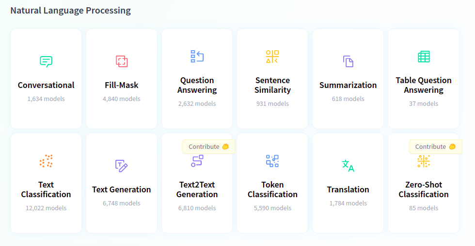

```{r setup, include=FALSE}
knitr::opts_chunk$set(echo = FALSE)
library(reticulate)
library(quanteda)
library(lexicon)
use_virtualenv("~/software/py39")
library(dplyr)
library(ggplot2)
```


```{python include=FALSE}
import math
import pandas as pd
import matplotlib.pyplot as plt
from matplotlib.colors import Normalize
import numpy as np

def plot_heatmap(X, xlabs, ylabs):
    # Plot a heatmap of the dfm
    fig, ax = plt.subplots()
    ax.imshow(
        X,
        cmap = "Greys",
        norm = Normalize(vmin=0, vmax=X.max()*2)
    )

    # Create a grid using minor ticks
    ax.set_xticks(np.arange(X.shape[1])+0.5, minor=True)
    ax.set_yticks(np.arange(X.shape[0])+0.5, minor=True)
    ax.grid(which="minor", zorder=5)

    # Set up x labels
    ax.xaxis.tick_top()
    ax.set_xticks(np.arange(X.shape[1]))
    ax.set_xticklabels(xlabs, rotation=60, ha="left", va="bottom")

    # Set up y labels
    ax.set_yticks(range(len(ylabs)))
    ax.set_yticklabels(ylabs)

    # Put the numbers in
    for m in range(X.shape[0]):
        for n in range(X.shape[1]):
            ax.text(n, m, f"{X[m, n]:.2f}", ha="center", va="center")
            
plt.show()
```

# Introduction and Objectives

## Assignment 2

Thanks to all who submitted assignment 2. You can expect your grades by the end of this week week.

## Fancy NLP

Today we arrive at the promised "fancy NLP". We'll look at

\begin{enumerate}
  \item<1->\textbf{Transformers} and BERT-based models for machine learning with texts
  \item<2->\textbf{Spacy}: which is a ``swiss-army knife'' for doing various tasks with texts
\end{enumerate}

\only<3->{We are working in python because that is what most of the machine learning and CS people use, and that is where these resources are available}

\only<4->{-> For those new to python you should become slightly more familiar with how we run code in notebooks, what a "package" is, and what the code looks like.}

# BERT

## BERT

:::::: {.cols data-latex=""}

::: {.col data-latex="{0.4\textwidth}"}

\begin{itemize}
  \item<1->BERT - (Bidirectional Encoder Representations from Transformers) is a \textbf{language representation model} which changed how we do NLP.
  
  \item<2->BERT is \textbf{pre-trained} (on a masked language model task cf. WordVectors and a next sentence prediction task) on huge text corpora.
  
  \item<3->It can be \textbf{fine-tuned} on a multitude of different tasks using new data.
  
  \item<4->A fine-tuned BERT model offered a step-change increase in performance.
\end{itemize}


:::

::: {.col data-latex="{0.05\textwidth}"}
\ 
:::

::: {.col data-latex="{0.55\textwidth}"}

\begin{figure}
\includegraphics[width=\linewidth]{images/il-bert.png}
\end{figure}

:::

::::::


## What's new with BERT

With BERT, the vector representation for each token is *dependent on its context* (using self-attention).

So, the representation of "cooler" will be different in the two sentences:

- Thursday will see \textbf{cooler} temperatures in the South-East, as a cold front moves in''
- The new remake of the film is way \textbf{cooler} than the original.

This takes us far beyond bag-of-words. BERT has learnt representations of texts that are not reliant on such unrealistic assumptions.

## What's wrong with BERT

However, BERT, and large language models in general have some drawbacks (see [Stochastic Parrots](https://dl.acm.org/doi/10.1145/3442188.3445922) among others  \includegraphics[height=0.5cm]{images/parrot.png}:

\begin{itemize}
  \item<1->Fine-tuning BERT requires more resources
  \item<2->Understanding results and where they come from is harder
  \item<3->Training these models requires enormous resources, with significant environmental costs
  \item<4->Models keep getting (much) bigger and (marginally) better, concentrating power in the hands of those with big compute budgets
  \item<5->The same problems with bias, but bigger, and less transparent!
  \item<6->...
\end{itemize}

# Hugging-Face

## The Hugging-Face Ecosystem

Huggingface is an ecosystem of thousands of models and datasets for NLP tasks, but also audio and computer vision tasks. 




## Pipelines

We can run many of these tasks, with any model we can find on huggingface, with just a few lines of code using [Pipelines](https://huggingface.co/docs/transformers/main_classes/pipelines).

\scriptsize

```{python echo=TRUE, include=TRUE, message=FALSE}
from transformers import pipeline
from rich.pretty import pprint
pipe = pipeline("sentiment-analysis")
res = pipe(["This movie was really bad", "I loved watching this movie"])
pprint(res)
```

## Pipelines - Text classification

If you look through the models on huggingface and [filter by task](https://huggingface.co/models?pipeline_tag=text-classification&p=1&sort=downloads), you will find a variety of pre-trained models for text classification. Using one of these is simple.

\medskip
\scriptsize

```{python echo=TRUE, include=TRUE, message=FALSE}
pipe = pipeline("text-classification", model="nbroad/ESG-BERT")
res = pipe("The Hertie School is committed to embedding and mainstreaming diversity, equity and inclusion into all areas of its activities.")
pprint(res)
```

## Pipelines - Text Generation (here be dragons!)

You can also use a model to generate text, but be warned this is likely to cause convincing-sounding "hallucinations" [examples and discussion](https://twitter.com/search?q=galactica&src=typed_query). 

\medskip
\scriptsize

```{python echo=TRUE, include=TRUE, message=FALSE}
from textwrap import wrap
run_galactica = False
if run_galactica:
    pipe = pipeline("text-generation", model="facebook/galactica-1.3b")
else:
    pipe = pipeline("text-generation")
    
res = pipe("Large language models can be useful. However,")
pprint(wrap(res[0]["generated_text"]))
```

## Exercise

Generate a response using any pipeline that shows the potential of language models to cause *harm*. 

Describe a real world application in which it would do so.

## Fine-tuning

We can also fine-tune any pre-trained model for a classification problem for which we have labelled examples. This requires a few steps, some not inconsiderable computational power, and some patience.

Using GPUs speeds things up considerably.

We will run a small example on our own machines, with a small set of texts.

\medskip

\scriptsize

```{python echo=TRUE, include=TRUE, message=FALSE}
# Let's take our texts and our labels again
texts, y = zip(
    *[
        ("Climate change is impacting human systems", 1),
        ("Climate change is caused by fossil fuels", 0),
        ("Agricultural yields are affected by climate change", 1),
        ("System change not climate change", 0),
        ("higher temperatures are impacting human health", 1),
        ("Forest fires are becoming more frequent due to climate change", 1),
        ("Machine learning can read texts", 0),
        ("AI can help solve climate change!", 0),
        ("We need to save gas this winter", 0),
        ("More frequent droughts are impacting crop yields", 1),
        ("Many communities are affected by rising sea levels", 1),
        ("Global emissions continue to rise", 0),
        ("Ecosystems are increasingly impacted by rising temperatures", 1),
        ("Emissions from fossil fuels need to decline", 0),
        ("Anthropogenic climate change is impacting vulnerable communities", 1),
    ]
)
```

## Tokenization

First we need to tokenize our texts. It's easier if we put everything in a huggingface dataset object and tokenize this

\medskip
\scriptsize

```{python echo=TRUE, include=TRUE, message=FALSE}
from datasets import Dataset
from transformers import AutoTokenizer
dataset = Dataset.from_dict({"text": texts, "label": y})
model_name = "bert-base-uncased"
tokenizer = AutoTokenizer.from_pretrained(model_name)
def tokenize_function(examples):
    return tokenizer(examples["text"], padding="longest", truncation=True)
tokenized_dataset = dataset.map(tokenize_function, batched=True)
tokenized_dataset
```


## Tokenization

To make this even simpler, we can create a function that turns a list of texts (and list of labels) into a tokenized dataset, given a tokenizer.

\medskip
\scriptsize

```{python echo=TRUE, include=TRUE, message=FALSE}
def datasetify(x, tokenizer, y=None):
    data_dict = {"text": x}
    if y is not None:
        data_dict["label"] = y
    dataset = Dataset.from_dict(data_dict)

    def tokenize_function(examples):
        return tokenizer(examples["text"], padding="longest", truncation=True)

    return dataset.map(tokenize_function, batched=True)
  
train_data = datasetify(texts, tokenizer, y)
```


## Training a model

We can load a model and train it using an instance of the `Trainer` class.

\medskip
\scriptsize

```{python echo=TRUE, include=TRUE, message=FALSE}
from transformers import AutoModelForSequenceClassification, Trainer
# We set num_labels to 2 for binary classification, as we have two classes - positive and negative
model = AutoModelForSequenceClassification.from_pretrained(model_name, num_labels=2)
trainer = Trainer(model=model, train_dataset=datasetify(texts, tokenizer, y))
# Once this has been instantiated we can apply the train() method
trainer.train()
```

## Making predictions

With a trained model, we can make predictions on a set of new texts

\medskip
\scriptsize

```{python echo=TRUE, include=TRUE, message=FALSE}
# To generate predictions, we just need to supply a dataset to the predict method
new_texts = [
    "climate change is impacting terrestrial ecosystems",
    "Machine Learning will solve climate change",
    "Fossil fuels are responsible for rising temperature",
]
new_y = [1,0,0]

pred = trainer.predict(datasetify(new_texts, tokenizer, new_y))
pred
```

## Turning logits into probabilities

As we did last week, we need  a variation of the **sigmoid** function (**Softmax**) to turn our predictions (which are returned as logits) into probabilities. The softmax activation function ensures the probabilities for each class add up to 1 for each document. Note that these probabilities are not necessarily well calibrated.

\medskip
\scriptsize

```{python echo=TRUE, include=TRUE, message=FALSE}
# To generate predictions, we just need to supply a dataset to the predict method
from torch import tensor
from torch.nn import Sigmoid, Softmax
activation = (Softmax())
activation(tensor(pred.predictions))
```

## Creating a predict_proba function

If we miss our predict_proba function from sklearn, we can *subclass* Trainer, to provide an additional method

\medskip
\scriptsize

```{python echo=TRUE, include=TRUE, message=FALSE, cache=TRUE}
from transformers.trainer_utils import PredictionOutput

class ProbTrainer(Trainer):
    def predict_proba(self, test_dataset: Dataset) -> PredictionOutput:
        logits = self.predict(test_dataset).predictions
        activation = Softmax()
        return activation(tensor(logits)).numpy()


trainer = ProbTrainer(model=model, train_dataset=datasetify(texts, tokenizer, y))
trainer.train()
```

## Creating a predict_proba function

If we miss our predict_proba function from sklearn, we can *subclass* Trainer, to provide an additional method

\medskip
\scriptsize

```{python echo=TRUE, include=TRUE, message=FALSE, cache=TRUE}
pred = trainer.predict_proba(datasetify(new_texts, tokenizer))
pred
```

## Hyperparameters

The original BERT paper defined a hyperparameter space that should be searched when fine-tuning a BERT model. These are data-dependent and values outside these ranges may make improvements in some contexts.

\medskip
\scriptsize

```{python echo=TRUE, include=TRUE, message=FALSE, cache=TRUE}
params = {
  "batch_size": [16, 32],
  "learning_rate": [5e-5, 3e-5, 2e-5],
  "number of epochs": [2,3,4]
}
import itertools
def product_dict(**kwargs):
    keys = kwargs.keys()
    vals = kwargs.values()
    for instance in itertools.product(*vals):
        yield dict(zip(keys, instance))
param_space = list(product_dict(**params))
len(param_space)
```

## Hyperparameters

We can plug these values into a TrainingArguments object, which we pass to our trainer. This would take quite some time.

\medskip
\scriptsize

```{python echo=TRUE, include=TRUE, message=FALSE, cache=TRUE, eval=FALSE}
from transformers import TrainingArguments
for p in param_space:
    training_args = TrainingArguments(
        num_train_epochs=p["number of epochs"],
        learning_rate=p["learning_rate"],
        per_device_train_batch_size=p["batch_size"],
        output_dir="out"
    )
    trainer = ProbTrainer(model=model, train_dataset=datasetify(texts, tokenizer, y), args=training_args)
    trainer.train()
    # Evaluate our model
```

## Pre-training

If we have lots of *unlabelled* data from a specific domain, doing additional *pretraining*
of a transformer-based model may increase its performance in classifying *labelled* data.

See [Don’t Stop Pretraining: Adapt Language Models to Domains and Tasks](https://aclanthology.org/2020.acl-main.740/).

However, this is *much* more resource intensive, and there are now thousands of models available, some of which might have been trained on similar data.

## Exercise - Training your own model
 
In small groups, repeat the classification task in last week's slides with a model of your choosing from transformers.

Did the model perform better or worse than our support vector machine?

# Spacy

## What is spacy

Spacy provides "industrial-strength" Natural Language Processing.

It is most useful for processing texts, but its latest version also claims support for Transformers and the huggingface model ecosystem.

We'll explore a few examples to get you used to the syntax and documentation

## Advanced tokenization

You can process a document into a list of tokens with Spacy, and each token contains many [attributes and methods](https://spacy.io/api/token)

\medskip
\scriptsize

```{python echo=TRUE, include=TRUE, message=FALSE, cache=TRUE}
import spacy
nlp = spacy.load("en_core_web_md")
text = "Students at the Hertie School in Berlin learn how to use Spacy"
doc = nlp(text)
for token in doc:
    print(token.text, token.lemma_, token.pos_,token.is_stop)
```

## Named Entity Recognition

Named entities are real-world objects referred to in a text. Spacy can guess what phrases are what types of real-word objects.


\medskip
\scriptsize

```{python echo=TRUE, include=TRUE, message=FALSE, cache=TRUE}
nlp = spacy.load("en_core_web_md")
doc = nlp(text)
for ent in doc.ents:
    print(ent.text, ent.label_)
```

## Embeddings in Spacy

Spacy also already puts our documents and tokens into an embedding space

\medskip
\scriptsize

```{python echo=TRUE, include=TRUE, message=FALSE, cache=TRUE}
nlp = spacy.load("en_core_web_md")
doc = nlp(text)
tok = doc[0]
print(tok.vector.shape)
texts = [
  "The acclaimed author penned novels based on her life",
  "Nobel prize-winning writer writes autobiographical fiction"
]
docs = [nlp(t) for t in texts]
docs[0].similarity(docs[1])
```

## Exercise

In small groups, retrieve our manifesto dataset.

Extract only the adjectives from the manifestos. 

Which adjectives are used most often by each party?

# Wrapup

## Wrapup

Today we have covered

- How transformer-based models work (at a very high level) and what they do
- How to use pre-trained models for a variety of tasks
- How to fine-tune existing models for our own classification tasks
- How to use spacy

This concludes the input part of the course!

## Assignment 3

Next week we'll see 7 student presentations.

Each group will have **8** minutes to present (*strictly enforced*), with 4 minutes for questions (mainly from the audience!). 

Present directly from your laptop, which we will connect to the projector via HDMI cable (bring an adaptor if necessary). Try to keep transitions < 1 minute!