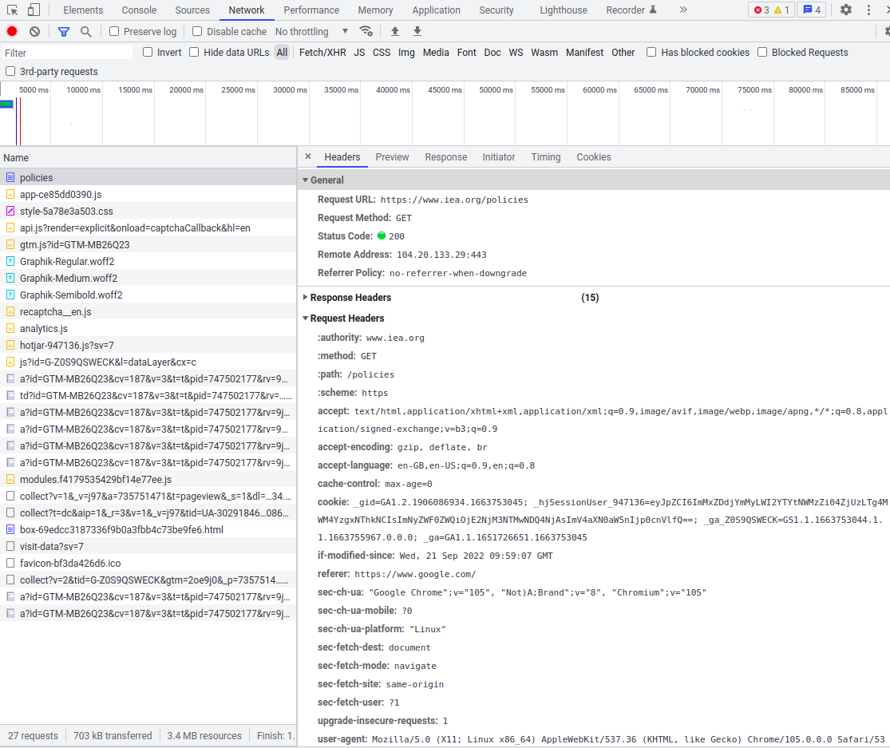
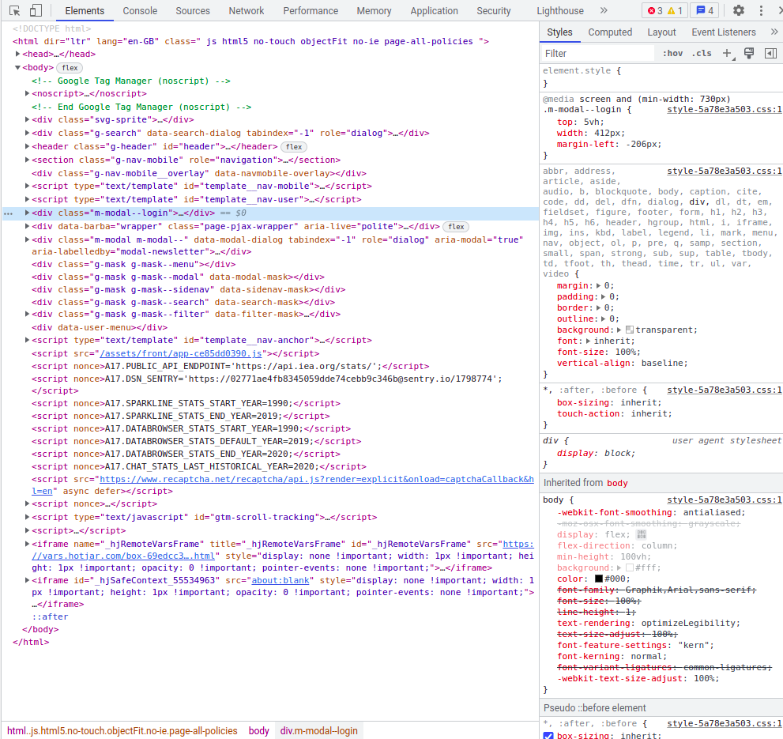

```{r setup, include=FALSE}
knitr::opts_chunk$set(echo = FALSE)
library(reticulate)
library(quanteda)
library(lexicon)
use_python("/usr/bin/python3.9")

#def.chunk.hook  <- knitr::knit_hooks$get("chunk")
#knitr::knit_hooks$set(chunk = function(x, options) {
#  x <- def.chunk.hook(x, options)
#  paste0("\n \\", "tiny","\n\n", x, "\n\n \\normalsize")
#})

```


```{python include=FALSE}
import requests
import pandas as pd
from bs4 import BeautifulSoup
from rich.pretty import pprint
```

# Objectives

## Methods

By the end of this session, you will be able to

\begin{itemize}
  \item<1-> Scrape texts from a website
  \item<2-> Use an API to retrieve texts
  \item<3-> Read texts stored in various formats and process these with R
\end{itemize}

## Fundamentals of the internet

You should also acquire some important fundamental knowledge about how the internet works

\begin{itemize}
  \item<1-> What is a request, how do you make one, and how can this information be specified?
  \item<2-> What responses can be generated from a request, and how can we process these?
  \item<3-> How are html and json files structured, and how can we use them
\end{itemize}

## Text sources

We will explore how to gain access to the following sources of text

\begin{itemize}
  \item<1-> The IEA's Policies and Measures database, by scraping the website
  \item<2-> Scientific articles, using the OpenAlex API
  \item<2-> Twitter posts, using their API
  \item<3-> Parliamentary data, by parsing XML data published by Hansard
\end{itemize}

# Scraping texts

## What does "scrape" mean, and why do we need to do it?

The internet is full of text data, but it is frequently *presented* - **unstructured** - on websites, rather than made available in **structured** data files. 

If we want to do more than just **browse** this data, we need to give our computer instructions on how to systematically download the data of interest.

## What happens when we browse the internet?

\only<2->{
When we write a url into our web browser and press enter, what we are doing is sending a \textbf{request} to an \textbf{address}.

In our first example, we are going to look at \url{https://www.iea.org/policies}. 

\begin{itemize}
  \item \url{https} defines the \href{https://en.wikipedia.org/wiki/HTTPS}{protocol}
  \item \url{www.iea.org} defines the \href{https://en.wikipedia.org/wiki/Hostname}{hostname}
  \item \url{policies} defines the path on the host containing the resources we require
\end{itemize}

}

\only<3->{
If we click on open the url with chrome or firefox, we can investigate further by opening developer tools (ctrl+shift+i). Today we will look at the \textbf{Network} and \textbf{Elements} tabs
}

## Making Requests

:::::: {.cols data-latex=""}

::: {.col data-latex="{0.35\textwidth}"}

If you click on the **Network** tab and refresh, you can see all the communication that is happening when we visit a page. 

Clicking on policies, we can inspect how this starts.

Our browser sends a request to the url, along with **headers**, which explain how the request should be processed.

We then receive a response, which has content, a status code, and it's own set of headers.

:::

::: {.col data-latex="{0.05\textwidth}"}
\ 
::: 

::: {.col data-latex="{0.60\textwidth}"}

{}

:::
::::::

## Making requests with R

We can mimic this R using [httr](https://cran.r-project.org/web/packages/httr/vignettes/quickstart.html)

\scriptsize

```{r echo=TRUE, include=TRUE, cache=TRUE}
library(httr)
r <- GET("https://www.iea.org/policies")
r
```

## Making requests with Python

In Python, a similar no-frills option is [requests](https://requests.readthedocs.io/en/latest/user/quickstart/)

\scriptsize

```{python echo=TRUE, include=TRUE, cache=TRUE}
import requests
from rich.pretty import pprint
r = requests.get("https://www.iea.org/policies")
pprint(r.__dict__, max_string=40)
```


## Understanding HTML responses

:::::: {.cols data-latex=""}

::: {.col data-latex="{0.35\textwidth}"}

If you click on the **Elements** tab, you will see the HTML response of the website. 

\ 

HTML is a hierarchical structure of [elements](https://developer.mozilla.org/en-US/docs/Web/HTML/Element) `<p>Hello</p>`. In this hierarchy we refer to

- the **root**
- parents
- children
- siblings

:::

::: {.col data-latex="{0.05\textwidth}"}
\ 
::: 

::: {.col data-latex="{0.60\textwidth}"}

{}

:::
::::::

## What is in a web element?

The element **name** is the first word after the opening `<`, and describes what *type* of element it is.

The element's **attributes** are the key, value pairs either side of the `=` signs before the `>`.

Element's should be closed with a `/` and a `>`. `<a></a>` and `<a/>` are both closed.

Anything between opening and closing tags (`<>`) is the element's content, or inner html. It can contain further elements (children)

You can find an element by clicking on the icon with the cursor in the developer tools

```
<a class="m-policy-listing-item__link" 
href="/policies/12654-emissions-limit-on-the-capacity-market-regulations">
Emissions limit on the Capacity Market Regulations
</a>
```

## Scraping elements

In our example from the IEA, we want to identify each element linking to a policy, and find a common feature of those links. We can select these by passing [css selectors](https://developer.mozilla.org/en-US/docs/Learn/CSS/Building_blocks/Selectors) to the `html_elements` function from [rvest](https://rvest.tidyverse.org/)

In this case they all have the class "m-policy-listing-item__link"

\scriptsize

```{r echo=TRUE, include=TRUE, cache=TRUE}
library(rvest)
html <- read_html("https://www.iea.org/policies")
links <- html %>% html_elements("a.m-policy-listing-item__link")
links
```

## Scraping elements

In our example from the IEA, we want to identify each element linking to a policy, and find a common feature of those links. We can select these by passing [css selectors](https://developer.mozilla.org/en-US/docs/Learn/CSS/Building_blocks/Selectors) to the `select` function of [Beautiful Soup](https://www.crummy.com/software/BeautifulSoup/bs4/doc/#css-selectors)

In this case they all have the class "m-policy-listing-item__link"

\scriptsize

```{python echo=TRUE, include=TRUE, cache=TRUE}
import requests
from bs4 import BeautifulSoup
r = requests.get("https://www.iea.org/policies")
soup = BeautifulSoup(r.content)
links = soup.select("a.m-policy-listing-item__link")
links
```

## Following links and extracting information

Now we want to follow each of these links, parse the website, and extract the information we want

\scriptsize

```{r echo=TRUE, include=TRUE, cache=TRUE}
library(tibble)
df <- tibble(text=character())
for (link in html_attr(links,"href")) {
  link_html <- read_html(paste0("https://iea.org",link))
  text <- link_html %>% html_element("div.m-block p") %>% html_text()
  df <- df %>% add_row(text=text)
  break
}
df
```

## Following links and extracting information

Now we want to follow each of these links, parse the html, and extract the information we want

\scriptsize

```{python echo=TRUE, include=TRUE, cache=TRUE}
import pandas as pd
data = []
for link in links:
    r = requests.get("https://iea.org" + link["href"])
    link_soup = BeautifulSoup(r.content)
    data.append({"text": link_soup.select("div.m-block p")[0].text})
    break
    
df = pd.DataFrame.from_dict(data)
df
```

## Exercise

Now in pairs, build a scraper that returns a dataframe with the columns [Country, Year, Status, Jurisdiction, Text, Link, Topics, Policy types, Sectors, Technologies]

How would you extend this scraper to collect the whole database (not just the first page)?

# APIs

## What is an API and how do I use it?

An API is a *predefined* set of possible requests, with a given set of possible responses and response formats. 

APIs usually return **data** rather than instructions for building a web page.

They are explicitly built for access by machines, and should stay consistent over time.

\medskip

\only<2->{

The first API we will look at is for the open catalog of scientific research \href{https://docs.openalex.org/}{OpenAlex}

For more details on OpenAlex, have a look at this \href{https://github.com/mcallaghan/NLP-climate-science-tutorial-CCAI/blob/main/A_obtaining_data.ipynb}{tutorial} I gave for a summer school.

}

## Constructing an API call

Let's start by searching the institutions endpoint for the Hertie School

\url{https://api.openalex.org/institutions?filter=display_name.search:hertie}

We can plug the ID we find here into a query of the works enpoint, where we search works where an author is affiliated with Hertie

\url{https://api.openalex.org/works?filter=authorships.institutions.id:I24830596}

## Parsing Json

Now we just need to parse the json, which is very easy in python

\scriptsize

```{python echo=TRUE, include=TRUE, cache=TRUE}
from dotenv import load_dotenv
import os
load_dotenv()
headers = {"email": os.getenv("email")}
r = requests.get(
  "https://api.openalex.org/works?filter=authorships.institutions.id:I24830596",
  headers=headers
)
res = r.json()
pprint(res, max_string=21, max_length=5)
```

## Parsing Json

Now we just need to parse the json, which is very easy in python, and a bit of a pain in R. For now we'll just let create a dataframe with dataframes inside it

\scriptsize

```{r echo=TRUE, include=TRUE, cache=TRUE, warning=FALSE}
library(jsonlite)
library(dplyr)
library(dotenv)
load_dot_env(".env")
r <- GET(
  "https://api.openalex.org/works?filter=authorships.institutions.id:I24830596",
  add_headers(email=Sys.getenv("email"))
  )
data <- fromJSON(content(r, "text"))
df <- cbind(
  select(data$results, where(is.character)), 
  select(data$results, where(is.numeric))
)
head(df)
```

## Paginated results

Where datasets are large, APIs will often not give us the whole dataset at once, but deliver it in chunks. They will have their own way of letting us navigate through these, but often this will involve cursors.

With open Alex, we simply add \url{&cursor=*} to our url the first time we make a request, and keep using the new cursor it returns until it is Null

## Paginated results

\scriptsize

```{r echo=TRUE, include=TRUE, cache=TRUE, warning=FALSE}
cursor <- "*"
base_url <- "https://api.openalex.org/works?filter=authorships.institutions.id:I24830596"
df <- NULL
while (!is.null(cursor)) {
  r <- GET(paste0(
    base_url, "&per-page=200",
    "&cursor=",cursor
  ), add_headers(email=Sys.getenv("email")))
  data <- fromJSON(content(r, "text", encoding="utf-8"), simplifyDataFrame = TRUE)
  if (length(data$results) == 0) { break }
  page_df <- cbind(
    select(data$results, where(is.character)), 
    select(data$results, where(is.numeric))
  )
  df <- rbind(df, page_df)
  cursor <- data$meta$next_cursor
}
nrow(df)
```

## Paginated results

\scriptsize

```{python echo=TRUE, include=TRUE, cache=TRUE, warning=FALSE}
cursor = "*"
base_url = "https://api.openalex.org/works?filter=authorships.institutions.id:I24830596"
works = []
while cursor is not None:
    r = requests.get(f"{base_url}&per-page=200&cursor={cursor}", headers=headers)
    res = r.json()
    if len(res["results"])==0:
        break
    for work in res["results"]:
        w = {}
        for k, v in work.items():
            if type(v) not in [dict, list] and v is not None:
                w[k] = v
        works.append(w)
    cursor = res["meta"]["next_cursor"]
    
df = pd.DataFrame.from_dict(works)
print(df.shape)
df.head()
```


## Using a Library to speak to an API

Often, someone will already have built a scraper or an API for the dataset you are looking for. These might be called [Client libraries](https://docs.openalex.org/api#client-libraries). 

Always search this first, but these libraries often do very simple things.

One thing that can be especially annoying is **authentication**. We're going to use [rtweet](https://cbail.github.io/textasdata/apis/rmarkdown/Application_Programming_interfaces.html)

## Rtweet

To use rtweet, you will need to authenticate interactively (by leaving the argument blank) using the "Bearer Token" you generated on the [twitter](https://developer.twitter.com/en/portal/apps/) website, or provide the token directly to `rtweet_app``. NEVER expose your secret keys in a Github repository!

Once you have done this you can pass the result as the **token** argument to your API call. For now, we will explore the `search_tweets` endpoint

\scriptsize

```{r echo=TRUE, include=TRUE, cache=TRUE, warning=FALSE}
library(rtweet)
library(dotenv)
load_dot_env(".env")
auth <- rtweet_app(Sys.getenv("bearer_token"))
rt <- search_tweets("hertie", n = 1000, include_rts = FALSE, token=auth)
rt
```

## Tweepy

Tweepy is a similar library for python, which works in a similar way

\scriptsize

```{python echo=TRUE, include=TRUE, cache=TRUE, warning=FALSE}
import tweepy
from dotenv import load_dotenv
import os
load_dotenv()

auth = tweepy.OAuth2BearerHandler(os.getenv("bearer_token"))
api = tweepy.API(auth)
results = api.search_tweets("hertie")
json_data = [r._json for r in results]
df = pd.json_normalize(json_data)
df
```

## Some limitations of twitter

Without the academic API, twitter search offers only a non-random sample of recent tweets

Even with the academic API, many limitations remain

- Geotag availability
- Non-representative populations
- Country/language overlaps
- Bots

Still, it is a very interesting data source, and valuable for understanding social behaviour *on twitter*

# Other data sources

## Parliamentary data from Hansard

Hansard keeps a record of all the debates made in the UK parliament. These have have been parsed as XML files (which are quite like html) and are available in a time series going back more than a century [here](https://parser.theyworkforyou.com/hansard.html).

We can use RVest to parse these

\scriptsize

```{r echo=TRUE, include=TRUE, cache=TRUE, warning=FALSE}
library(rvest)
data <- read_html("https://www.theyworkforyou.com/pwdata/scrapedxml/debates/debates2022-09-10a.xml")
speeches <- data %>% html_elements("speech") 
df <- as_tibble(do.call(rbind, html_attrs(speeches)))
df$text <- speeches %>% html_text()
df
```

## Parliamentary data from Hansard

Hansard keeps a record of all the debates made in the UK parliament. These have have been parsed as XML files (which are quite like html) and are available in a time series going back more than a century [here](https://parser.theyworkforyou.com/hansard.html).

We can use RVest to parse these, or BeautifulSoup in Python

\scriptsize

```{python echo=TRUE, include=TRUE, cache=TRUE, warning=FALSE}

r = requests.get("https://www.theyworkforyou.com/pwdata/scrapedxml/debates/debates2022-09-10a.xml")
soup = BeautifulSoup(r.content)
speeches = soup.select("speech")
rows = []
for s in speeches:
    row = s.attrs
    row["text"] = s.text
    rows.append(row)
df = pd.DataFrame.from_dict(rows)
print(df.shape)
df.head()
```


# Wrapup

## Exercise

We've had a look at 4 different data sources. Pick one, alter the query parameters (if applicable) and try to process it as we did last week. Report on commonly used words in the data. 

## Extensions

Sometimes, neither RVest / BeautifulSoup nor APIs will get you the data you want. You may need to sign in, or click on certain buttons to make pages load, especially if they use a lot of Javascript to generate the pages.

In these cases, check out [Selenium](https://www.selenium.dev/), which allows you to automate a browser and interact fully with websites.

## Ethics

We are talking about collecting data that is publicly available, but it still matters

\begin{itemize}
  \item<1->What data you scrape or access
  \item<2->Who you are
  \item<3->Who created the data and what their expectations were about its use
  \item<4->How you intend to use the data, and what potential consequences that entails
\end{itemize}

\only<5->{
  As a general rule, when working with twitter data, we only publish individual tweets when the user is a public person or has expressly approved the use
}

\only<5->{
 We should also be considerate not to overload sites with requests, and to follow their instructions for scraping when these are reasonable (check robots.txt)
}

## Wrapup and outlook

In the next session, we'll cover **regex** expressions, and how we can use [stringr](https://journal.r-project.org/archive/2010/RJ-2010-012/RJ-2010-012.pdf) to clean, manage, manipulate, and extract useful data from unstructured texts.

