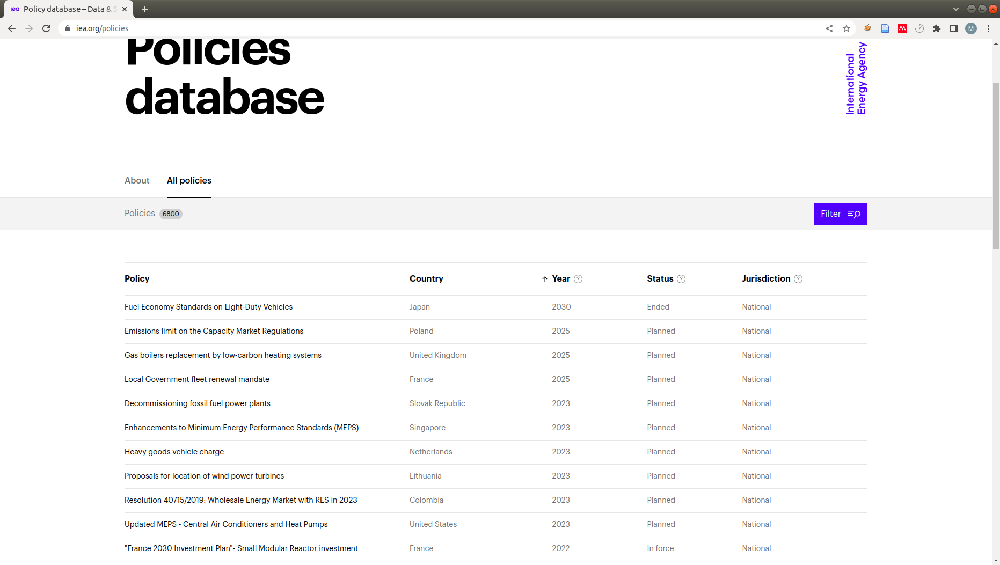
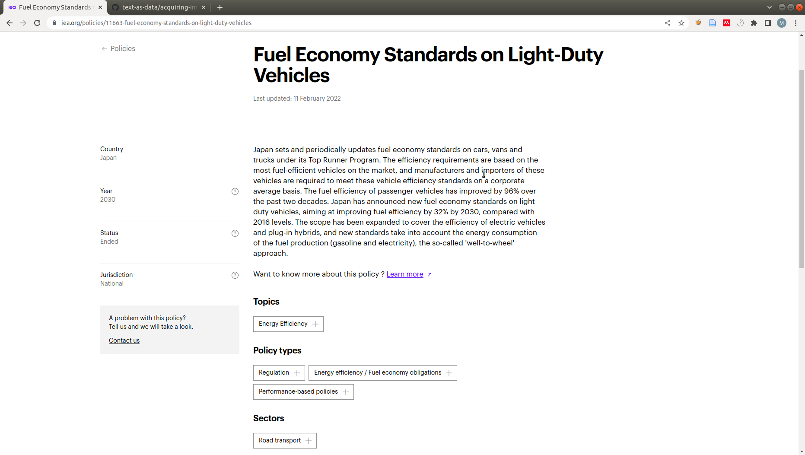
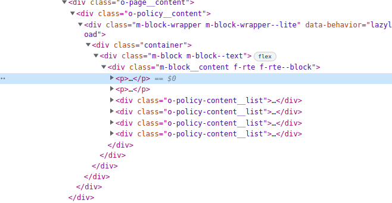
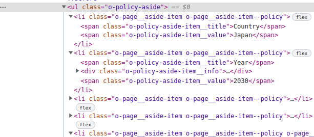

```{r setup, include=FALSE}
knitr::opts_chunk$set(echo = TRUE)
```

Here's how to scrape 1 page of the policy database of the IEA, in a very step-by-step fashion.

The site https://www.iea.org/policies looks like this:

{}

It's got a table of policies, but the table doesn't contain all the information we want about those policies.

To get that information, we will have to follow the links to those policies, and extract it from that page.

## How do we get the page as data?

To get and parse (understand) the page, we can use rvest `read_html()`

```{r echo=TRUE, include=TRUE}
library(rvest)
html <- read_html("https://www.iea.org/policies")
html
```

The variable `html` now holds our parsed html from the page

## How do we find the links?

We can see the links on the page, and if we open the developer tools window, we can find the element in the html

{}


Highlighted, we see an element which looks like this: 

```{html} 
<a class="m-policy-listing-item__link" href="/policies/11663-fuel-economy-standards-on-light-duty-vehicles">
  Fuel Economy Standards on Light-Duty Vehicles
</a>
```

## How do we find these links with R?

We can search for the links using the `html_elements()` function from rvest. We search using CSS selectors, which is just one way to select elements from a web page. [This](https://www.w3schools.com/cssref/css_selectors.asp) is a nice explanation of how these work, and you can also try these interactively [here](https://try.jsoup.org/) (you can copy your html by rght clicking on the body tag of your website (right at the top of the elements tab) and selecting copy outer HTML).

In our case we can see that our links are elements of the type `a` (because a is the first word after the `<` character). They also have the class "m-policy-listing-item__link" (pay attention to the number of underscores!). This means our selector looks like this `"a.m-policy-listing-item__link"`, which means "select all `a` elements that have the class `m-policy-listing-item__link`".

```{r echo=TRUE, include=TRUE} 
links <- html %>% html_elements("a.m-policy-listing-item__link")
links
```

Now, these links all have a destination they are pointing to. We need this destination! It is stored in the attribute "href". Remember attributes are key,value pairs either side of an `=` sign. In our example, "href" is the key, and "/policies/11663-fuel-economy-standards-on-light-duty-vehicles" is the value. We can extract attributes using `html_attr`, specificying the **key** of the attribute we want to extract

```{r echo=TRUE, include=TRUE} 
link_destinations <- links %>% html_attr("href")
link_destinations
```

We apply this to our list of links, and get a character vector of links.

## Processing links

We are going to want to process all of these links, but let's start with the first one. Putting a number `n` into square brackets after a vector gives us the `nth` item of that vector

```{r echo=TRUE, include=TRUE} 
link <- link_destinations[1]
link
```

Now we want to visit this page, but the link is a relative link from where we were before. We can get the whole link using the `paste0()` function

```{r echo=TRUE, include=TRUE} 
absolute_link <- paste0("https://www.iea.org", link)
absolute_link
```

If we put this link into our browser, it looks like this

{}
Let's start by extracting the text. If we hover over the text, we can see it's in the first `<p>` (paragraph) element of a `<div>` which has the class "m-block__content f-rte f-rte--block". 



We can select this with the css selector "div.m-block__content p", which means "give me all `<p>` elements which are inside a `<div>` element that has the class `m-block__content`. If we use `html_element()` as opposed to `html_elements()` then we will just get the first item that matches our search. In this case, that's the one we want

```{r echo=TRUE, include=TRUE} 
# First we read the html from the link we came up with earlier
link_html <- read_html(absolute_link)
ps <- link_html %>% html_elements("div.m-block__content p")
print(ps)
p <- link_html %>% html_element("div.m-block__content p")
p
```
Now, if we apply `html_text2()`, or `html_text()` (which does less formatting), we get the text that is in that paragraph!

```{r echo=TRUE, include=TRUE} 
text <- p %>% html_text2()
text
```
## Now to tackle the sidebar

Some of the information we want is in a sidebar, and the html looks like this:



We can see that all of the values we want are contained inside `<span>` elements that have the class `o-policy-aside-item__value`. We can extract all of these by passing that CSS selector to `html_elements()` and passing the result to `html_text()`

```{r echo=TRUE, include=TRUE} 
values <- link_html %>% html_elements("span.o-policy-aside-item__value") %>% html_text()
values
```

If we trust that these will always appear in the same order, we can simply say the first item of this vector is the country, the second is the year, etc. We can represent this as a list. Attributes of a list can be assigned with either `l$attribute <- value` or `l["attribute"] <- value` (Note the quotes).

```{r echo=TRUE, include=TRUE} 
l <- list()
l$country <- values[1]
l["year"] <- values[2]
l$status <- values[3]
l["jurisdiction"] <- values[4]
```

However, if we are not sure about this, we can get the keys, and get the values, and construct a list. To do this, we **iterate** through the vectors of keys and values

```{r echo=TRUE, include=TRUE} 
keys <- link_html %>% html_elements("span.o-policy-aside-item__title") %>% html_text()
values <- link_html %>% html_elements("span.o-policy-aside-item__value") %>% html_text()
l <- list()
for (i in 1:length(keys)) { # Do a loop were we increase the value of i from 1 to the length of our keys
  print(i) # print i 
  key = keys[i] # Get the ith key in our vector of keys
  value = values[i] # Get the ith value in our vector of values
  l[key] = value # assign the value to the attribute that is named key
}
l
```
We can turn this list into a dataframe with `as.data.frame()`

```{r echo=TRUE, include=TRUE} 
link_df <- as.data.frame(l)
link_df
```
## Extracting Topics, Policy Types, and the other things in the boxes

Below the policy text, we can see some tags in boxes.

The html for these looks like this


Each set of tags is contained in a `<div>` element (which is a type of box), that has the class `o_policy-content__list`. Let's select these with a css_selector

```{r echo=TRUE, include=TRUE} 
tag_boxes <-link_html %>% html_elements("div.o-policy-content__list") 
tag_boxes
```
We'll want to process these one by one, so we can do a loop. For now, let's just take the second one

```{r echo=TRUE, include=TRUE} 
tag_box <-tag_boxes[2]
tag_box
```

If we look carefully at the html, we can see that within each `<div>` there is a `<span>` with the class `o-policy-content-list__title`. The text of that contains the type of tag. If we run `html_element()` on an element we have already identified (instead of the whole html), then we will look for our selection among that element's children.

```{r echo=TRUE, include=TRUE} 
title_span <- tag_box %>% html_element("span.o-policy-content-list__title") # search within our tag_box for span elements with the class o-policy....
title <- html_text(title_span) # Get the text of that element
title
```
Now we want to extract the tags themselves. These are contained in `<span>` elements that have the class `a-tag__label`.

```{r echo=TRUE, include=TRUE} 
tag_spans <- tag_box %>% html_elements("span.a-tag__label") # search within our tag_box for span elements with the class a-tag__label
tags <- html_text(tag_spans) # Get the text of those elements
tags
```
If we want to put these into a dataframe, we will need a single text value. We can use paste to paste these together. 

```{r echo=TRUE, include=TRUE} 
tag_string <- paste(tags, collapse="; ") # collapse tells us to collapse a vector of strings into a single string separated by semicolons and spaces
tag_string
```
### Processing all sets of tags

We want to do this for each box of tags we found, so we put this in a for loop.

```{r echo=TRUE, include=TRUE} 

for (tag_box in tag_boxes) {
  title_span <- tag_box %>% html_element("span.o-policy-content-list__title") # search within our tag_box for span elements with the class o-policy....
  title <- html_text(title_span) # Get the text of that element
  
  tag_spans <- tag_box %>% html_elements("span.a-tag__label") # search within our tag_box for span elements with the class a-tag__label
  tags <- html_text(tag_spans) # Get the text of those elements
  tag_string <- paste(tags, collapse="; ") # collapse tells us to collapse a vector of strings into a single string separated by semicolons and spaces
  
  l[title] <- tag_string # We can add to the list we made earlier
}
l
```

## Putting it all together

Now we are ready to put it all together inside a loop. In this loop we will process each link in turn. We'll just take the first 10 links, so as not to bother the IEA too much


```{r echo=TRUE, include=TRUE} 
library(dplyr)
df <- NULL # Let's initialise a null object which we will our dataframe to after each link
for (link in link_destinations[1:10]){
  # First we'll initialise an empty list to store our values
  l <- list()
  
  # Then we create our link and parse it
  absolute_link <- paste0("https://iea.org", link)
  print("processing link")
  print(absolute_link)
  link_html <- read_html(absolute_link)
  
  # Now we get our text from the paragraph as before
  p <- link_html %>% html_element("div.m-block__content p")
  l$text <- html_text2(p) # and add it to our list of attributes
  
  # Now we process the sidebar
  keys <- link_html %>% html_elements("span.o-policy-aside-item__title") %>% html_text()
  values <- link_html %>% html_elements("span.o-policy-aside-item__value") %>% html_text()
  for (i in 1:length(keys)) { # Do a loop were we increase the value of i from 1 to the length of our keys
    key = keys[i] # Get the ith key in our vector of keys
    value = values[i] # Get the ith value in our vector of values
    l[key] = value # assign the value to the attribute that is named key
  }
  
  # Now we process the tags
  tag_boxes <-link_html %>% html_elements("div.o-policy-content__list") 
  for (tag_box in tag_boxes) {
    title_span <- tag_box %>% html_element("span.o-policy-content-list__title") # search within our tag_box for the title span
    title <- html_text(title_span) # Get the text of that element
    
    tag_spans <- tag_box %>% html_elements("span.a-tag__label") # search within our tag_box for span elements with the class a-tag__label
    tags <- html_text(tag_spans) # Get the text of those elements
    tag_string <- paste(tags, collapse="; ") # collapse tells us to collapse a vector of strings into a single string separated by semicolons and spaces
    
    l[title] <- tag_string # We can add to the list we made earlier
  }
  df <- bind_rows(df, as.data.frame(l))
}
df
```


