```{r setup, include=FALSE}
knitr::opts_chunk$set(echo = FALSE)
library(reticulate)
library(quanteda)
library(lexicon)
use_virtualenv("~/software/py39")
library(dplyr)
library(ggplot2)
```


```{python include=FALSE}
import math
```

# Objectives

## Objectives

In this session we will start exploring how to visualise texts and their features with R and Python. 

We are going to explore this using [ggplot2](https://ggplot2.tidyverse.org/) and [seaborn](https://seaborn.pydata.org/).

# First plots with ggplot2 / Seaborn

## First plots

Let's first load some data. 

\scriptsize

```{r echo=TRUE, include=TRUE, cache=TRUE, message=FALSE}
df <- readr::read_csv("data/hertie_papers.csv")
head(df,3)
```

```{python echo=TRUE, include=TRUE, warning=FALSE}
import pandas as pd
df = pd.read_csv("data/hertie_papers.csv")
df.head(3)
```

## A line plot with ggplot

The first thing we will do is plot the number of papers per year.

:::::: {.cols data-latex=""}

::: {.col data-latex="{0.58\textwidth}"}


`count()` gives us the number of observations of each value of the variable(s) we give it.

\medskip

Now we can say to ggplot that the "aesthetic mapping" we want is that x should show the publication year and y should show the count of papers in that year

\medskip

\scriptsize
```{r echo=TRUE, results=FALSE, fig.show='hide', message=FALSE, cache=TRUE}

annual_pubs <- df %>% count(publication_year) 

ggplot(annual_pubs, aes(publication_year, n)) +
  geom_line()
ggsave("plots/pubs_time_gg.png", width=4, height=4)
  
```
:::

::: {.col data-latex="{0.04\textwidth}"}
\ 
:::

::: {.col data-latex="{0.38\textwidth}"}


:::

::::::

## A bar plot with ggplot

:::::: {.cols data-latex=""}

::: {.col data-latex="{0.58\textwidth}"}

ggplot has a variety of different [geoms](https://ggplot2.tidyverse.org/reference/index.html). Each translates our aesthetic mapping to ink on paper in a consistent and clearly defined way.

\medskip

\scriptsize
```{r echo=TRUE, results=FALSE, fig.show='hide', message=FALSE, cache=TRUE}

annual_pubs <- df %>% count(publication_year) 

ggplot(annual_pubs, aes(publication_year, n)) +
  geom_col()
ggsave("plots/pubs_time_bar_gg.png", width=4, height=4)
  
```
:::

::: {.col data-latex="{0.04\textwidth}"}
\ 
:::

::: {.col data-latex="{0.38\textwidth}"}
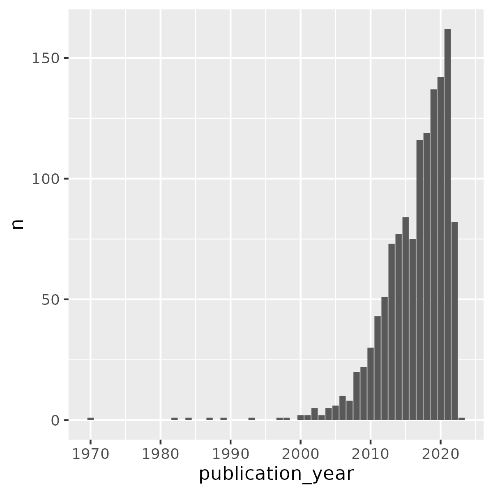
:::

::::::

## A scatter plot with ggplot

:::::: {.cols data-latex=""}

::: {.col data-latex="{0.58\textwidth}"}

With ggplot, we define the parameters of the plot, and then we can keep adding "geoms" that inherit these parameters.

\medskip

We build up the plot bit by bit by adding more grammar.
\scriptsize
```{r echo=TRUE, results=FALSE, fig.show='hide', message=FALSE, cache=TRUE}

annual_pubs <- df %>% count(publication_year) 

ggplot(annual_pubs, aes(publication_year, n)) +
  geom_line() + 
  geom_point() + 
  theme_bw() +
  labs(
    title="Publications by someone with a Hertie affiliation", 
    x="Publication Year"
  )
ggsave("plots/pubs_time_point_gg.png", width=4, height=4)
  
```
:::

::: {.col data-latex="{0.04\textwidth}"}
\ 
:::

::: {.col data-latex="{0.38\textwidth}"}

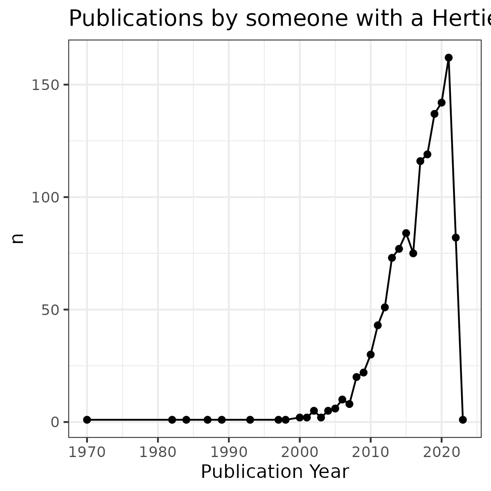

:::

::::::


## A line plot with seaborn

:::::: {.cols data-latex=""}

::: {.col data-latex="{0.58\textwidth}"}

Seaborn works nicely with things in dataframes, so we need to groupby and count, and coerce the result into a dataframe

\scriptsize

```{python echo=TRUE, results=FALSE, warning=FALSE, fig.show="hide"}
import matplotlib.pyplot as plt
import seaborn as sns
df = pd.read_csv("data/hertie_papers.csv")
yps = (df
        .groupby(["publication_year"])["id"]
        .count()
        .to_frame("n_pubs")
        .reset_index()
      )
ax = sns.relplot(
  data=yps, kind="line", 
  x="publication_year", y="n_pubs"
)
ax.set(xlabel="Publication Year", ylabel="Number of publications")
plt.savefig("plots/pubs_time_sns.png")
```

:::

::: {.col data-latex="{0.04\textwidth}"}
\ 
:::

::: {.col data-latex="{0.38\textwidth}"}

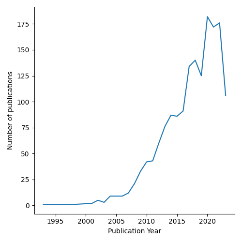

:::

::::::

## A line plot with pandas

:::::: {.cols data-latex=""}

::: {.col data-latex="{0.58\textwidth}"}

Pandas can already produce a lot of the plots we want

\scriptsize


```{python mplLine, echo=TRUE, results=FALSE, warning=FALSE, fig.show="hide", cache=TRUE}
import matplotlib.pyplot as plt
import seaborn as sns
fig, ax = plt.subplots(figsize=(4,4))
df.groupby(["publication_year"])["id"].count().plot(ax=ax)
ax.set_xlabel("Publication Year")
ax.set_ylabel("Number of Publications")
ax.set_title("Publications by someone with a Hertie affiliation")
plt.savefig("plots/pubs_time_pd.png")
```

:::

::: {.col data-latex="{0.04\textwidth}"}
\ 
:::

::: {.col data-latex="{0.38\textwidth}"}

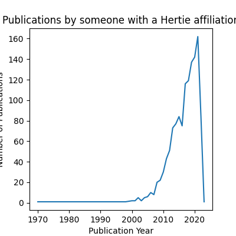

:::

::::::


## A bar plot with seaborn

:::::: {.cols data-latex=""}

::: {.col data-latex="{0.58\textwidth}"}

Seaborn is also "opinionated" and makes strong assumptions about what you want to do. According to seaborn, if you are making a bar plot, then one of your variables is likely categorical and it will plot it accordingly.

\medskip 

\scriptsize

```{python echo=TRUE, results=FALSE, warning=FALSE, fig.show="hide", cache=TRUE}
import matplotlib.pyplot as plt
import seaborn as sns
df = pd.read_csv("data/hertie_papers.csv")
yps = (df
        .groupby(["publication_year"])["id"]
        .count()
        .to_frame("n_pubs")
        .reset_index()
      )
ax = sns.barplot(data=yps, x="publication_year", y="n_pubs")
ax.set(xlabel="Publication Year", ylabel="Number of publications")
plt.savefig("plots/pubs_time_bar_sns.png")
```

:::

::: {.col data-latex="{0.04\textwidth}"}
\ 
:::

::: {.col data-latex="{0.38\textwidth}"}

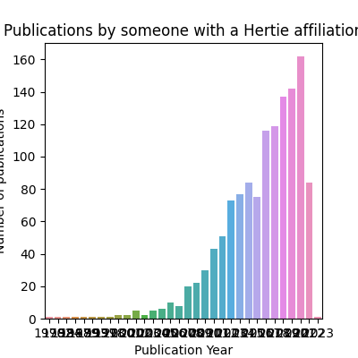

:::

::::::


## A bar plot with matplotlib

:::::: {.cols data-latex=""}

::: {.col data-latex="{0.58\textwidth}"}

Matplotlib is sometimes the simplest option for simple plots.

\medskip 

\scriptsize

```{python echo=TRUE, results=FALSE, warning=FALSE, fig.show="hide", cache=TRUE}
import matplotlib.pyplot as plt
import seaborn as sns
df = pd.read_csv("data/hertie_papers.csv")
yps = (df
        .groupby(["publication_year"])["id"]
        .count()
        .to_frame("n_pubs")
        .reset_index()
      )
fig, ax = plt.subplots(figsize=(4,4))
ax.bar(yps["publication_year"], yps["n_pubs"])
ax.set_xlabel("Publication Year")
ax.set_ylabel("Number of Publications")
ax.set_title("Publications by someone with a Hertie affiliation")
plt.savefig("plots/pubs_time_bar_mpl.png")
```

:::

::: {.col data-latex="{0.04\textwidth}"}
\ 
:::

::: {.col data-latex="{0.38\textwidth}"}

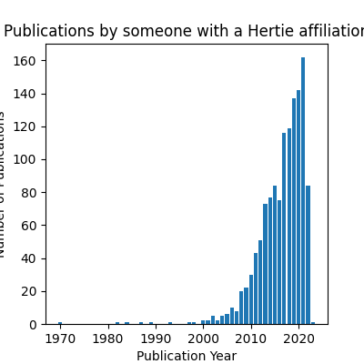

:::

::::::

## Exercise

Load the authorship data in `data/author_df.csv` and make a horizontal bar plot showing the 10 authors who have published the most papers *with Hertie affiliations*. In R you may need the functions `filter()`, `count()`, `arrange()`,  and `head()/tail()`. In python you will need to filter data `df[df["x"]=="y"]`, and to use the `sort_values()` as well as `head()/tail()`

# Plotting text data

## What text data can we plot

- Frequencies of features
- frequencies of features in subgroups or over time
- relationships between features
- relationships between features and text/author variables

## Back to our document feature matrix

Let's create a document feature matrix from our list of abstracts

\scriptsize

```{r echo=TRUE, include=TRUE, cache=TRUE, message=FALSE}
library(quanteda)
df <- df %>% filter(!is.na(abstract))
dfmat <- df$abstract %>%
  tokens(remove_punc=TRUE) %>%
  tokens_remove(pattern=stopwords("en")) %>%
  tokens_wordstem("english") %>%
  dfm()
dfmat
```

```{python echo=TRUE, include=TRUE, message=FALSE}
from sklearn.feature_extraction.text import CountVectorizer, TfidfVectorizer
vectorizer = CountVectorizer(stop_words="english")
df = df[pd.notna(df["abstract"])].reset_index(drop=True)
dfm = vectorizer.fit_transform(df["abstract"])
dfm
```

## Most common features

:::::: {.cols data-latex=""}

::: {.col data-latex="{0.58\textwidth}"}

`quanteda.textstats::textstat_frequency()` gives us the frequency of each term in the corpus.
\medskip 

\scriptsize

```{r echo=TRUE, include=TRUE, cache=TRUE, message=FALSE, fig.show="hide"}
library(quanteda.textstats)
tfreq <- dfmat %>% textstat_frequency() %>% head(20)
tfreq$feature <- factor(tfreq$feature, levels=tfreq$feature)
ggplot(tfreq, aes(x=frequency, y=feature)) +
  geom_col()

ggsave("plots/top_terms_gg.png", width=4, height=4)
```

:::

::: {.col data-latex="{0.04\textwidth}"}
\ 
:::

::: {.col data-latex="{0.38\textwidth}"}

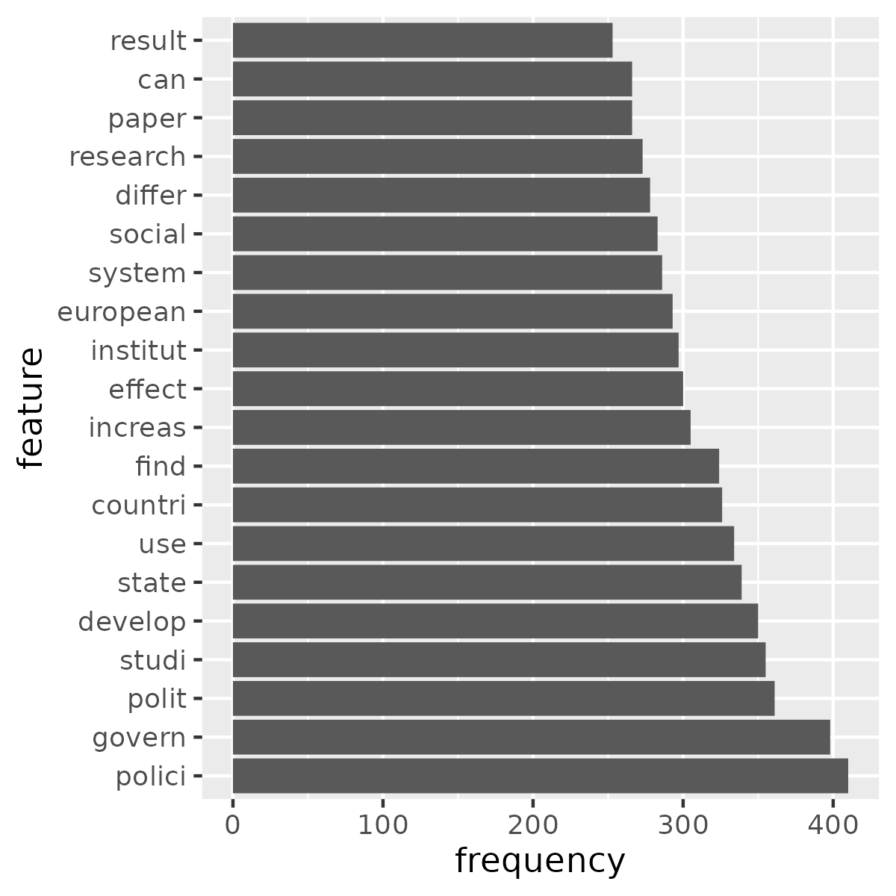

:::

::::::

## Common features in subgroups

:::::: {.cols data-latex=""}

::: {.col data-latex="{0.58\textwidth}"}

We can also get the frequency of features per subgroup
\medskip 

\scriptsize

```{r echo=TRUE, include=TRUE, cache=TRUE, message=FALSE, fig.show="hide"}
ytfreq <- dfmat %>% 
  textstat_frequency(groups=df$publication_year) 
ytfreq$group <- as.numeric(ytfreq$group)
interesting_features <- ytfreq %>%
  filter(feature %in% c("european","climat"))

ggplot(
  interesting_features, 
  aes(x=group, y=frequency, colour=feature)
) +
  geom_point() +
  geom_line() + 
  theme_bw()

ggsave("plots/top_terms_time.png", width=4, height=4)
```

:::

::: {.col data-latex="{0.04\textwidth}"}
\ 
:::

::: {.col data-latex="{0.38\textwidth}"}

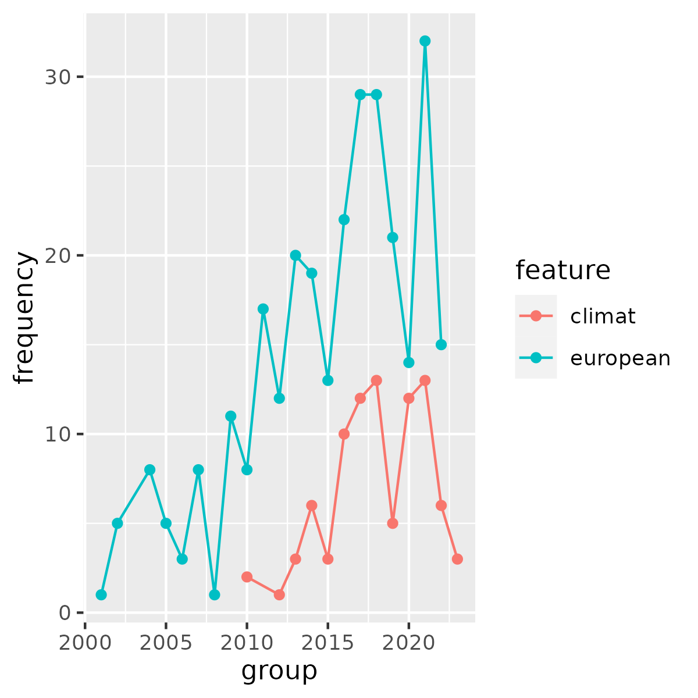
:::

::::::

## Most common features in Python

:::::: {.cols data-latex=""}

::: {.col data-latex="{0.58\textwidth}"}

In pandas we can make a dataframe of the sum of each column and the feature names
\medskip 

\scriptsize

```{python echo=TRUE, include=TRUE, message=FALSE, fig.show="hide"}
counts = dfm.sum(axis=0).A1
tidy_dfm = pd.DataFrame({
    "count": counts, 
    "feature": vectorizer.get_feature_names_out()
}).sort_values("count",ascending=False).reset_index(drop=True)

fig, ax = plt.subplots(figsize=(4,4))
sns.barplot(
  data=tidy_dfm.head(10), 
  x="count", y="feature", color="grey"
)

plt.savefig("plots/top_terms_sns.png", bbox_inches="tight")
```

:::

::: {.col data-latex="{0.08\textwidth}"}
\ 
:::

::: {.col data-latex="{0.38\textwidth}"}

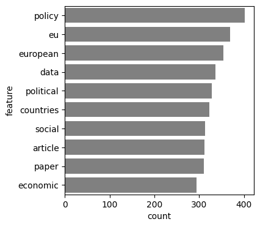

:::

::::::


## Common features in subgroups in Python

:::::: {.cols data-latex=""}

::: {.col data-latex="{0.58\textwidth}"}

Summing the features per subgroup in Python simply requires some low-level arithmetic and indexing
\medskip 

\scriptsize

```{python echo=TRUE, include=TRUE, cache=TRUE, message=FALSE, fig.show="hide"}
tidy_dfm = pd.DataFrame()
features = vectorizer.get_feature_names_out()
for name, group in df.groupby("publication_year"):
    counts = dfm[group.index,:].sum(axis=0).A1
    group_df = pd.DataFrame({
        "count": counts,
        "feature": features,
        "group": name
    })
    tidy_dfm = pd.concat([
      tidy_dfm, 
      group_df[group_df["count"]!=0]
    ]).reset_index(drop=True)

interesting_features = tidy_dfm[
  tidy_dfm["feature"].isin(["climate","european"])
]
sns.relplot(
  data=interesting_features, x="group", y="count", 
  hue="feature", kind="line"
)

plt.savefig("plots/top_terms_time_sns.png")
```

:::

::: {.col data-latex="{0.04\textwidth}"}
\ 
:::

::: {.col data-latex="{0.38\textwidth}"}

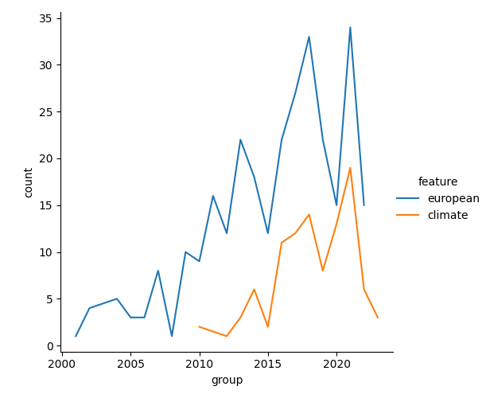
:::

::::::


## Comparing subgroups

:::::: {.cols data-latex=""}

::: {.col data-latex="{0.58\textwidth}"}

If we want to compare two subgroups directly, we might plot one against the other
\medskip 

\scriptsize

```{r echo=TRUE, include=TRUE, cache=TRUE, message=FALSE, fig.show="hide"}
library(quanteda.textstats)
df$era <- ifelse(df$publication_year<2017, "Pre", "Post")

ytfreq <- dfmat %>% textstat_frequency(groups=df$era) %>%
  pivot_wider(id_cols=feature, names_from=group, values_from=frequency)

ggplot(ytfreq, aes(x=Post, y=Pre)) +
  geom_point() + 
  coord_fixed()

ggsave("plots/scattertext_gg.png", width=4, height=4)
```

:::

::: {.col data-latex="{0.04\textwidth}"}
\ 
:::

::: {.col data-latex="{0.38\textwidth}"}

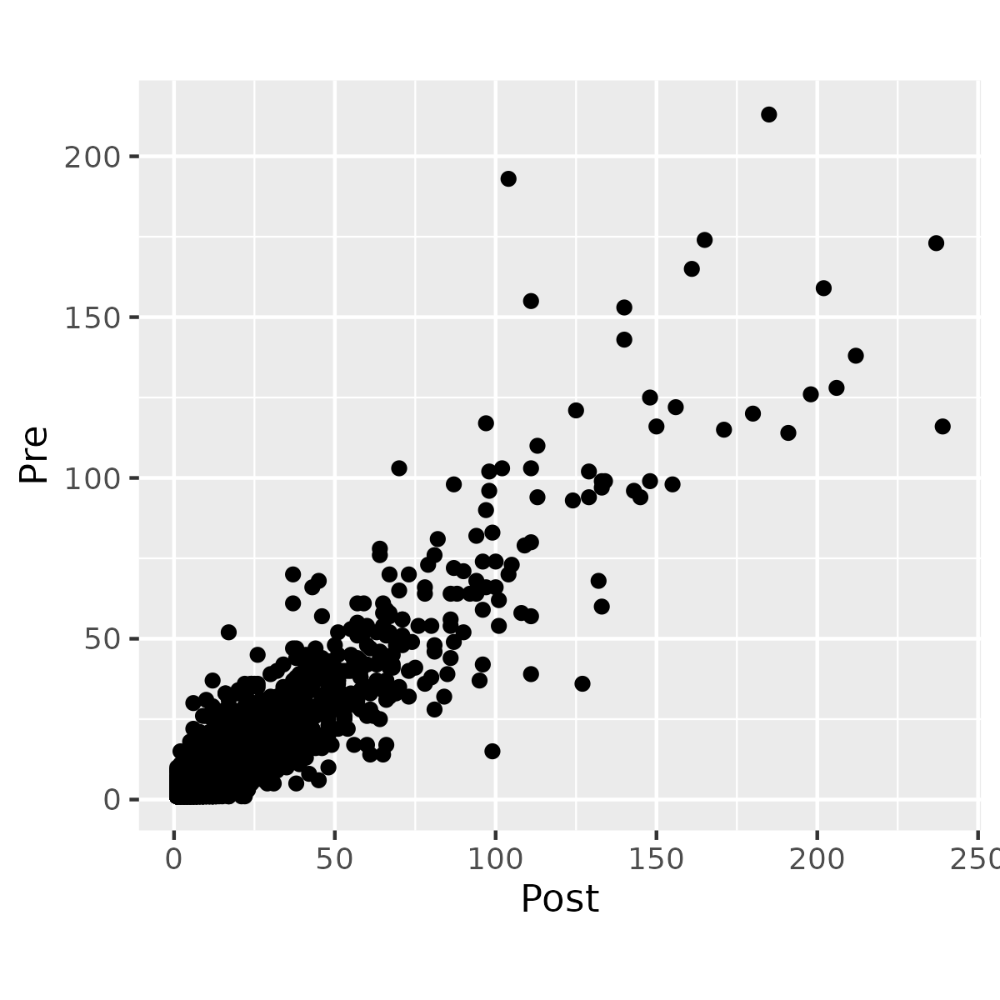
:::

::::::

## Long vs wide data

We often need to rely on the `tidyr::pivot_wider()` and `tidyr::pivot_longer()` functions (formerly `spread()` and `gather()`) to get data into the format we need.

\tiny

:::::: {.cols data-latex=""}

::: {.col data-latex="{0.32\textwidth}"}

```{r echo=TRUE, include=TRUE, cache=TRUE, message=FALSE, fig.show="hide"}
dfmat %>% textstat_frequency(groups=df$era) %>%
  head()
```

:::

::: {.col data-latex="{0.03\textwidth}"}
\ 
:::

::: {.col data-latex="{0.32\textwidth}"}
```{r echo=TRUE, include=TRUE, cache=TRUE, message=FALSE, fig.show="hide"}
dfmat %>% textstat_frequency(groups=df$era) %>%
  pivot_wider(id_cols=feature, names_from=group, values_from=frequency) %>%
  head()
```
:::

::: {.col data-latex="{0.03\textwidth}"}
\ 
:::

::: {.col data-latex="{0.32\textwidth}"}
```{r echo=TRUE, include=TRUE, cache=TRUE, message=FALSE, warning=FALSE, fig.show="hide"}
dfmat %>% textstat_frequency(groups=df$era) %>%
  pivot_wider(id_cols=feature, names_from=group, values_from=frequency) %>%
  pivot_longer(cols=Post:Pre, names_to="group") %>%
  head()
```
:::

::::::

## Comparing subgroups

:::::: {.cols data-latex=""}

::: {.col data-latex="{0.58\textwidth}"}

In Pandas the functions we need to switch between wide and long data are `pivot_table()` and `melt()`
\medskip 

\scriptsize

```{python echo=TRUE, include=TRUE, message=FALSE, fig.show="hide"}
import numpy as np
df["era"] = np.where(df["publication_year"]<2017, "Pre", "Post")
tidy_dfm = pd.DataFrame()
features = vectorizer.get_feature_names_out()
for name, group in df.groupby("era"):
    counts = dfm[group.index,:].sum(axis=0).A1
    group_df = pd.DataFrame({
        "count": counts,
        "feature": features,
        "group": name
    })
    tidy_dfm = pd.concat([
      tidy_dfm, 
      group_df[group_df["count"]!=0]
    ]).reset_index(drop=True)
wide_dfm = tidy_dfm.pivot_table(
  index="feature", columns="group", values="count"
).reset_index().reset_index(drop=True)
sns.relplot(data=wide_dfm, x="Post", y="Pre")
plt.savefig("plots/scattertext_sns.png")
```

:::

::: {.col data-latex="{0.04\textwidth}"}
\ 
:::

::: {.col data-latex="{0.38\textwidth}"}

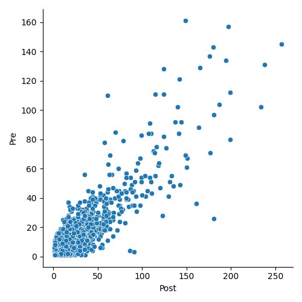
:::

::::::

## Using colour

Colour is another great way to convey information, and colorbrewer.org tells you all about colour scales, of which there are three kinds:

\begin{itemize}
  \item<2->\textbf{Sequential} \includegraphics[height=1cm]{images/seq.png} colourscales show differences in magnitude of a continuous variable 
  \item<3->\textbf{Diverging} \includegraphics[height=1cm]{images/div.png} colourscales show \textit{symmetrical} differences in magnitude either side of a meaningful central point 
  \item<4->\textbf{Qualitative} \includegraphics[height=1cm]{images/qual.png} colourscales shows different categories where there one category is neither greater than nor less than another 
\end{itemize}

\only<5>{PAY ATTENTION! to the colorblind-safe filter. A large proportion of people have reduced or no color discrimination along the red-green axis.}

## Using colour II

:::::: {.cols data-latex=""}

::: {.col data-latex="{0.58\textwidth}"}

\scriptsize

```{r echo=TRUE, include=TRUE, cache=TRUE, message=FALSE, warning=FALSE, fig.show="hide"}
ytfreq <- dfmat %>% dfm_weight(scheme="prop") %>% 
  textstat_frequency(groups=df$era) %>%
  filter(docfreq>10) %>%
  pivot_wider(
    id_cols=feature, 
    names_from=group, 
    values_from=frequency
  )

ytfreq$change <- log(ytfreq$Post / ytfreq$Pre)
max_change <- max(abs(ytfreq$change), na.rm=TRUE)

p <- ggplot(ytfreq, aes(x=Post, y=Pre, fill=change)) +
  geom_point(color="grey", shape=21) + 
  coord_fixed() + 
  scale_fill_gradientn(
    colors = c("#4575b4","white","#d73027"),
    values = scales::rescale(c(max_change*-1,0,max_change)),
    limits = c(max_change*-1,max_change)
  ) + 
  theme_bw()
p
ggsave("plots/scattertext_gg_2.png", width=4, height=3.5)
```

:::

::: {.col data-latex="{0.04\textwidth}"}
\ 
:::

::: {.col data-latex="{0.38\textwidth}"}

\small

In this plot we get the *proportion* of documents from each group each term occurs in. We represent the **change** from one era to another as a symmetrical variable either side of 0, and colour the points on an appropriate **diverging** scale. 

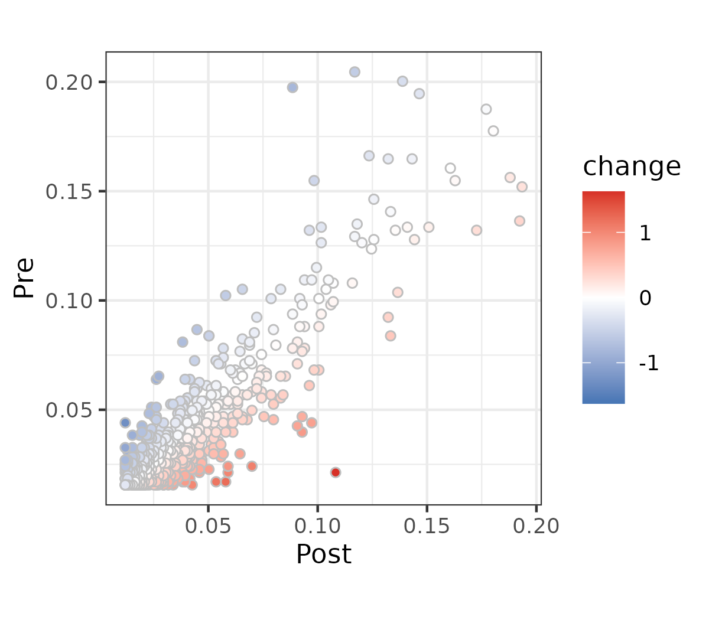
:::

::::::

## Adding labels

:::::: {.cols data-latex=""}

::: {.col data-latex="{0.58\textwidth}"}

\scriptsize

```{r echo=TRUE, include=TRUE, cache=TRUE, message=FALSE, warning=FALSE, fig.show="hide"}
#ytfreq <- ytfreq >max_value <- max(ytfreq$Post_2017, ytfreq$Pre_2017)
labels <- ytfreq %>% rowwise() %>% 
  mutate(max_value = max(Post,Pre)) %>%
  filter(
    (abs(change)>0.4 & max_value>2.5)
  )

p + geom_label(data=labels, aes(label=feature))

ggsave("plots/scattertext_gg_3.png", width=4, height=3.5)
```

:::

::: {.col data-latex="{0.04\textwidth}"}
\ 
:::

::: {.col data-latex="{0.38\textwidth}"}

We can add labels so we know what the points represent, but these often get in the way of readability

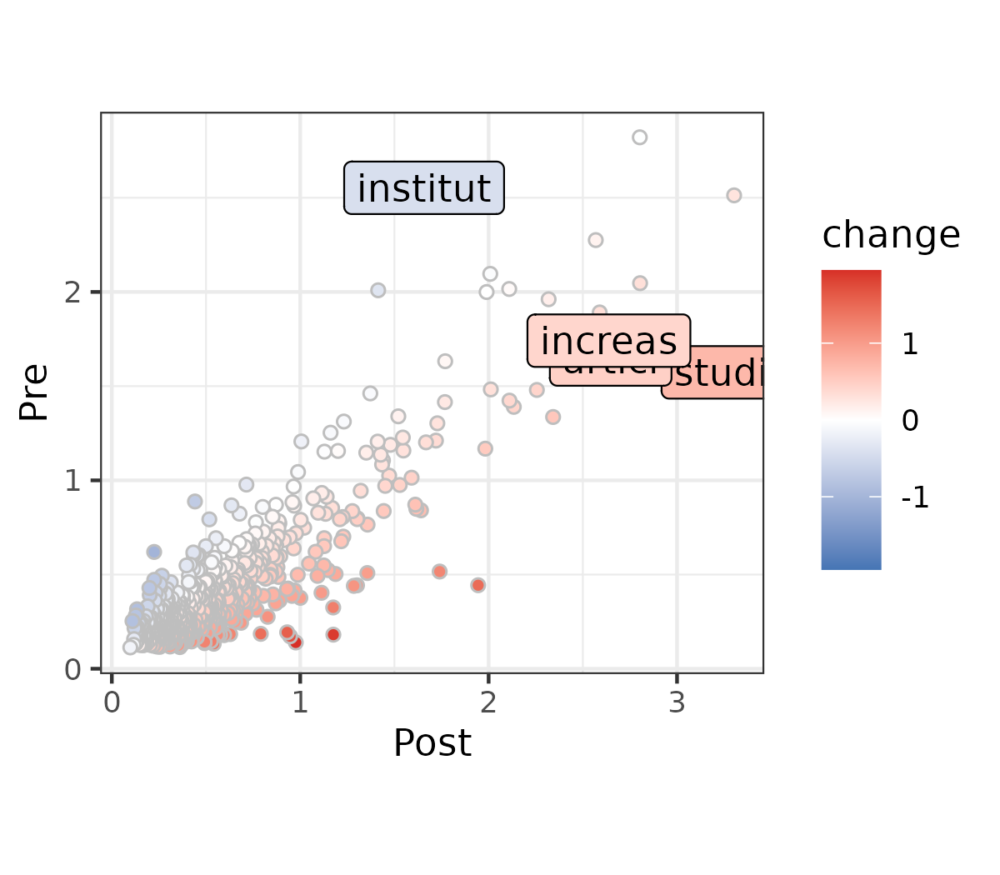
:::

::::::

## Adding labels with ggrepel

:::::: {.cols data-latex=""}

::: {.col data-latex="{0.58\textwidth}"}

\scriptsize

```{r echo=TRUE, include=TRUE, cache=TRUE, message=FALSE, warning=FALSE, fig.show="hide"}
library(ggrepel)

labels <- ytfreq %>% rowwise() %>% 
  mutate(max_value = max(Post,Pre)) %>%
  filter(
    (abs(change)>0.4 & max_value>2.5)
  )

p + geom_label_repel(
  data=labels, 
  aes(label=feature), 
  min.segment.length = 0
)

ggsave("plots/scattertext_gg_4.png", width=4, height=3.5)
```

:::

::: {.col data-latex="{0.04\textwidth}"}
\ 
:::

::: {.col data-latex="{0.38\textwidth}"}

We can add labels so we know what the points represent, but these often get in the way of readability

\medskip

`ggrepel` allows us to put labels in positions that maintain readability

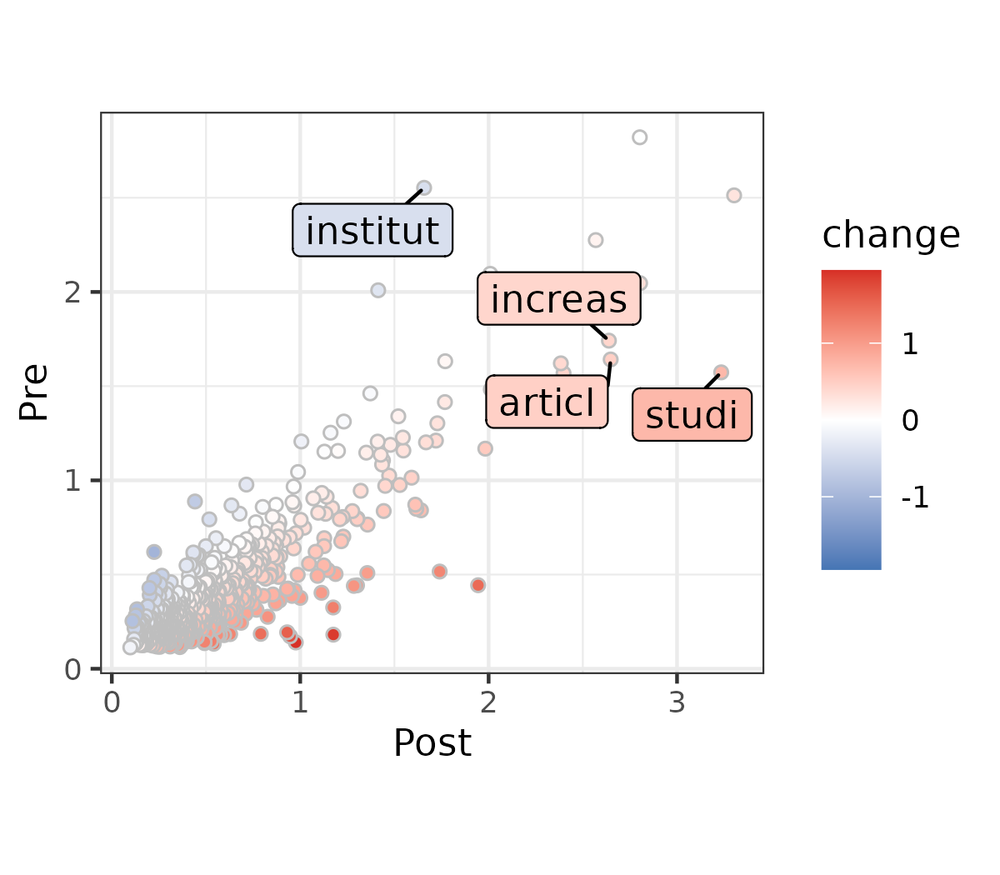
:::

::::::

## Color with Python

:::::: {.cols data-latex=""}

::: {.col data-latex="{0.58\textwidth}"}

\scriptsize

```{python echo=TRUE, include=TRUE, message=FALSE, warning=FALSE, fig.show="hide"}
tidy_dfm = pd.DataFrame()
for name, group in df.groupby("era"):
    counts = np.count_nonzero(
      dfm[group.index,].A, axis=0
    ) / group.shape[0]
    group_df = pd.DataFrame({
        "count": counts,
        "feature": features,
        "group": name
    })
    tidy_dfm = pd.concat([
      tidy_dfm, group_df[group_df["count"]!=0]
    ]).reset_index(drop=True)
wide_dfm = tidy_dfm.pivot_table(
  index="feature", columns="group", values="count"
).reset_index().reset_index(drop=True)

from matplotlib.colors import CenteredNorm
import matplotlib.cm as cm
colormap = cm.RdBu
norm = CenteredNorm()
wide_dfm["change"] = np.log(wide_dfm["Post"] / wide_dfm["Pre"])
sns.relplot(
    data=wide_dfm, x="Post", y="Pre", hue="change", 
    palette=colormap, norm=norm, edgecolor="grey"
)
plt.savefig("plots/scattertext_sns_2.png")
```

:::

::: {.col data-latex="{0.04\textwidth}"}
\ 
:::

::: {.col data-latex="{0.38\textwidth}"}

We can do the color rescaling much more easily with matplotlib (which we use to tweak seaborn)


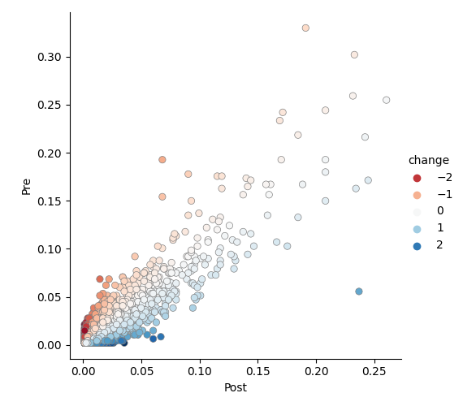
:::

::::::

## Color with Python

:::::: {.cols data-latex=""}

::: {.col data-latex="{0.58\textwidth}"}

\scriptsize

```{python echo=TRUE, include=TRUE, message=FALSE, warning=FALSE, fig.show="hide"}
labels = wide_dfm[
    (abs(wide_dfm["change"])>0.5) &
    (wide_dfm["Post"]+wide_dfm["Pre"]>.18)
]

from adjustText import adjust_text

scatter = sns.relplot(
    data=wide_dfm, x="Post", y="Pre", hue="change", 
    palette=colormap, norm=norm, edgecolor="grey"
)
ax = scatter.ax
texts = []
for i, row in labels.iterrows():
    texts.append(ax.text(row["Post"], row["Pre"], row["feature"]))

adjust_text(texts)
plt.savefig("plots/scattertext_sns_3.png")
```

:::

::: {.col data-latex="{0.04\textwidth}"}
\ 
:::

::: {.col data-latex="{0.38\textwidth}"}

We can do the color rescaling much more easily with matplotlib (which we use to tweak seaborn)

To arrange text labels nicely we can use `adjustText`, which works like ggrepel.


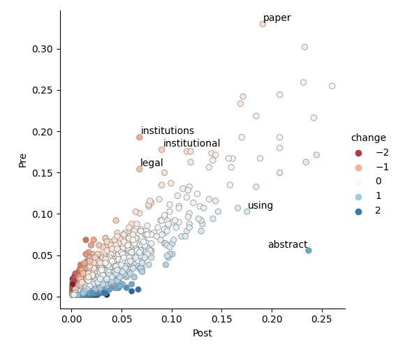
:::

::::::

# Wrapup and outlook

## Wrapup

Today we strengthened our data our data management skills, and had a refresher on ggplot2 / seaborn / matplotlib.

Getting data into the right format and plotting it is one of the *most import skills* as a data scientist!

The plotting libraries are much bigger than what we can cover, but you have enough to get started and extend by **reading the documentation**.

## Outlook

Next week we'll be getting more technical. We'll look at ways of measuring similarity and at how we can do dimensionality reduction.

## Homework

I will send you the homework assignment after class. This is due by 23:59 on 13 October. You are allowed - and *encouraged* - to ask questions when you are stuck, ideally as a Github Issue, so that your question and the answer will help everyone.