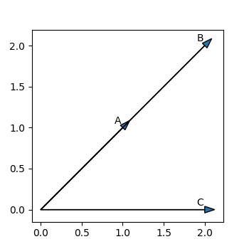
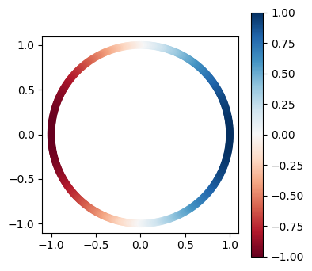
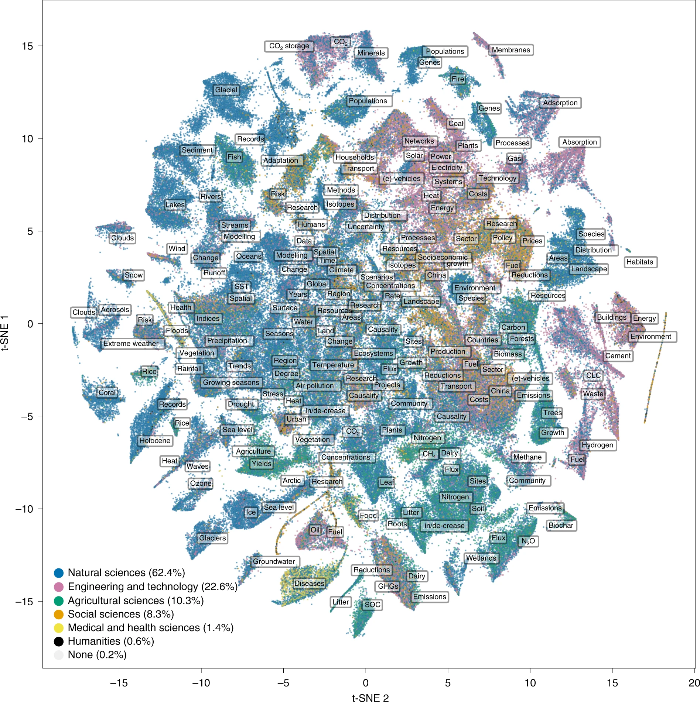
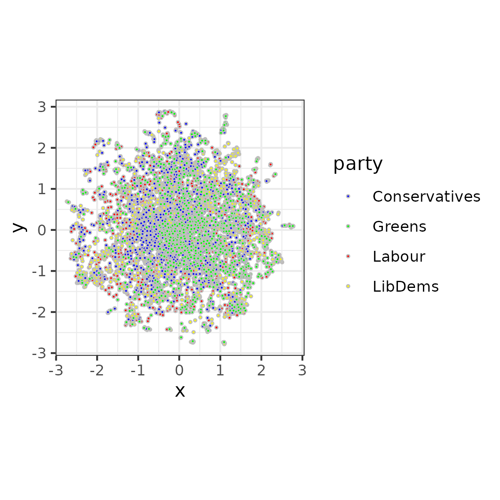
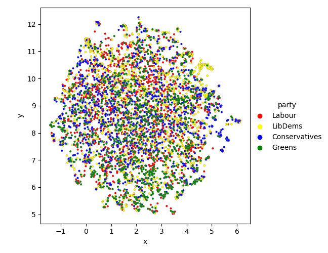

```{r setup, include=FALSE}
knitr::opts_chunk$set(echo = FALSE)
library(reticulate)
library(quanteda)
library(lexicon)
use_virtualenv("~/software/py39")
library(dplyr)
library(ggplot2)
```


```{python include=FALSE}
import math
import pandas as pd
```

# Introduction and Objectives

## Intro

:::::: {.cols data-latex=""}

::: {.col data-latex="{0.48\textwidth}"}

\begin{itemize}
  \item<1->The data manipulation tasks were **tricky**.
  \item<2->Don't be afraid to submit imperfect implementations that get us part of the way there
  \item<3->You will likely need loops: remember that the easiest way to get a loop working is to try it out on a single element of the sort you will be looping through.
  \item<4->Getting unstructured texts into data formats is a really important skill for real world text as data work. BUT, our focus shifts now on to what to do with this data.
  \item<5->However, this means we need a bit of maths today
\end{itemize}

:::

::: {.col data-latex="{0.04\textwidth}"}

\ 

:::


::: {.col data-latex="{0.48\textwidth}"}

\only<5->{
\includegraphics[width=\linewidth]{images/horse.png}
}

:::
::::::

## Objectives

By now we have figured out how to **represent** texts in a multidimensional space.

In this session we will find out 

- how to measure **similarity** in this space
- how to **reduce** the **dimensionality** of this space to make it easier to explore and visualise.

# Text similarity & distance

## Why similarity

Why do we want to measure whether texts are similar or different?

\begin{itemize}
  \item<2-> Retrieving relevant but inexact information
  \item<3-> Learning topics or clusters which group similar documents together
  \item<4-> Building a classifier that allocates labels to texts that a similar to our labelled data
\end{itemize}

What does similarity mean?

## Properties of a similarity metric

According to Grimmer, Roberts and Stewart,

\begin{enumerate}
  \item<1-> Maximum similarity should occur when comparing a document to itself
  \item<2-> Two documents that share no words in common should have minimum similarity
  \item<3-> Similarity should increase as more of the same words are used
  \item<4-> The measure should work symmetrically: A is similar to B as B is to A
\end{enumerate}

## Metrics: Vector representations of texts

Let us imagine we have 2 documents, which we represent in a document feature matrix. If we want to get the **vector** representation of each of these documents, we simply take the relevant row

:::::: {.cols data-latex=""}

::: {.col data-latex="{0.48\textwidth}"}

\scriptsize

```{r echo=TRUE, include=TRUE, error=TRUE}
library(quanteda)
texts <- c("apple orange pear", "apple pear quince")
dfmat <- texts %>%
  tokens() %>%
  dfm() %>%
  as.matrix()
print(dfmat)
a <- dfmat[1,]
b <- dfmat[2,]
print(a)
print(b)
```

:::

::: {.col data-latex="{0.04\textwidth}"}

\ 

:::


::: {.col data-latex="{0.48\textwidth}"}

\scriptsize
```{python echo=TRUE, include=TRUE, error=TRUE}
from sklearn.feature_extraction.text import CountVectorizer

texts = ["apple orange pear", "apple pear quince"]
vec = CountVectorizer()
dfmat = vec.fit_transform(texts).todense()

print(vec.get_feature_names_out())
print(dfmat)

a = dfmat[0,].A1
b = dfmat[1,].A1
print(a)
print(b)
```

:::
::::::


## Metrics: The inner product of two vectors

The simplest way to calculate the  similarity of two matrices is to calculate their **inner product** or **dot product**, which means multiply the first element of $a$ with the first element of $b$, and then the second, etc. and then add all these up.

\[\mathbf{a} \cdot \mathbf{b} =a_1b_1 + a_2b_2 + ...\]

\scriptsize
```{r echo=TRUE, include=TRUE, error=TRUE}
print(a*b)
inner_product = sum(a*b)
inner_product
```
## Metrics: the effect of long texts

Let's imagine we have a much longer text. As long as it has just one more word in commmon, by this measure it will be more similar.

\scriptsize

```{r echo=TRUE, include=TRUE, error=TRUE}
texts <- c(
  "apple orange pear", "apple pear quince",
  "apple pear orange quince peach avocado kiwi physalis"
)
dfmat <- texts %>% tokens() %>% dfm() %>% as.matrix()
print(dfmat)
a <- dfmat[1,]
b <- dfmat[2,]
c <- dfmat[3,]
print(a*c)
print(sum(a*c))
```

## Metrics: controlling for magnitude

We can compute the magnitude of a vector (denoted $||\mathbf{a}||$), by taking the square root of the inner product with itself

\[||\mathbf{a}|| = \sqrt{\mathbf{a} \cdot \mathbf{a}} \]

\scriptsize

```{r echo=TRUE, include=TRUE, error=TRUE}
print(a*a)
print(sqrt(sum(a*a)))

print(c*c)
print(sqrt(sum(c*c)))
```
## Metrics: cosine similarity

We can calculate what we call the **cosine similarity** by taking the **inner product** of two **magnitude normalized** vectors.

:::::: {.cols data-latex=""}

::: {.col data-latex="{0.315\textwidth}"}

\[ cos(\theta) = \frac{\mathbf{a}}{||\mathbf{a}||} \cdot \frac{\mathbf{b}}{||\mathbf{b}||}\]

:::

::: {.col data-latex="{0.05\textwidth}"}
\ 
:::

::: {.col data-latex="{0.68\textwidth}"}
\scriptsize
```{r echo=TRUE, include=TRUE, error=TRUE}
norm_a <- a/sqrt(sum(a*a))
print(norm_a)
norm_b <- b/sqrt(sum(b*b))
print(norm_b)
norm_c <- c/sqrt(sum(c*c))
print(norm_c)

print(sum(norm_a*norm_b))
print(sum(norm_a*norm_c))
```
:::

::::::

## Metrics: cosine similarity II

Let's create a document feature matrix with only 2 dimensions

```{python echo=TRUE, include=TRUE, error=TRUE}
from sklearn.feature_extraction.text import CountVectorizer
texts = ["apple pear","apple pear apple pear","apple apple"]
textnames = ["A","B","C"]
vec = CountVectorizer()
dfmat = vec.fit_transform(texts).todense()
a = dfmat[0,].A1
b = dfmat[1,].A1
c = dfmat[2,].A1
dfmat
```

## Metrics: cosine similarity III

:::::: {.cols data-latex=""}

::: {.col data-latex="{0.68\textwidth}"}

\medskip

\scriptsize
```{python echo=TRUE, results=FALSE, fig.show='hide', message=FALSE}
import matplotlib.pyplot as plt
fig, ax = plt.subplots(figsize=(3.5,3.5))
for i, row in enumerate(dfmat):
    x = row.A1[0]
    y = row.A1[1]
    ax.arrow(0,0,x,y,head_width=0.08)
    ax.text(x-0.1,y+0.05,textnames[i])
ax.set_aspect("equal")
plt.savefig("plots/cosine_similarity.png")
```
:::

::: {.col data-latex="{0.04\textwidth}"}
\ 
:::

::: {.col data-latex="{0.28\textwidth}"}



:::

::::::

\scriptsize

```{python echo=TRUE, include=TRUE, error=TRUE}
import numpy as np
cosine_sim = np.cos(np.radians(45))
print(cosine_sim)
def normed_inner_prod(a,b):
  norm_a = np.sqrt(sum(a*a))
  norm_b = np.sqrt(sum(b*b))
  return sum(a/norm_a * b/norm_b)
normed_inner_prod(a,c)
```
## Metrics: cosine similarity IV
:::::: {.cols data-latex=""}

::: {.col data-latex="{0.63\textwidth}"}

\medskip

\scriptsize
```{python echo=TRUE, results=FALSE, fig.show='hide', message=FALSE}
from matplotlib.colors import CenteredNorm
import matplotlib.cm as cm
colormap = cm.RdBu
norm = CenteredNorm()

fig, ax = plt.subplots(figsize=(4,4))

degrees = range(360)
radians = np.radians(degrees)
x = 1*np.cos(radians)
y = 1*np.sin(radians)
similarity = np.cos(radians)
   
circ = ax.scatter(x,y, c=similarity, norm=norm, cmap=colormap)
    
ax.set_aspect("equal")
plt.colorbar(circ)
plt.savefig("plots/cosine_similarity_distribution.png", bbox_inches="tight")
```
:::

::: {.col data-latex="{0.04\textwidth}"}
\ 
:::

::: {.col data-latex="{0.33\textwidth}"}



:::

::::::

## Exercise

Let's try to build a chain of texts that starts at

"Central bankers signal intention to press ahead with aggressive campaign to tighten monetary policy"

and ends at

"SpaceX’s Starlink terminals in Ukraine back online after outages"

We want to ensure each text in the chain has a similarity to the previous text that fulfils the condition

\[0.5 < cos(\theta) < 1\]

## Euclidean distance

The Euclidean distance between two points is the length of a line segment between those points.

:::::: {.cols data-latex=""}

::: {.col data-latex="{0.63\textwidth}"}

How would we calculate the length of the line between A and B?

\only<2->{Pythagoras!}
:::

::: {.col data-latex="{0.04\textwidth}"}
\ 
:::

::: {.col data-latex="{0.33\textwidth}"}


:::

::::::

## Euclidean distance

The Euclidean distance between two points is the length of a line segment between those points.

:::::: {.cols data-latex=""}

::: {.col data-latex="{0.63\textwidth}"}

How would we calculate the line between A and B?

\[d(p,q) = \sqrt{(q_1-p_1)^2 + (q_2-p_2)^2}\]

```{python echo=TRUE, include=TRUE, error=TRUE}
np.sqrt((a[0]-b[0])**2 + (a[1]-b[1])**2)
```

:::

::: {.col data-latex="{0.04\textwidth}"}
\ 
:::

::: {.col data-latex="{0.33\textwidth}"}


:::

::::::

## Computing similarity

We can compute similarity or distance using any common metric, and get the result as a matrix of pairwise comparisons.

\scriptsize

```{r echo=TRUE, include=TRUE, error=TRUE}
library(quanteda.textstats)
texts <- c(
  "apple orange pear", "apple pear quince",
  "apple pear orange quince peach avocado kiwi physalis"
)
dfmat <- texts %>% tokens() %>% dfm()
textstat_simil(dfmat, method="cosine")
```
## Computing similarity

We can compute similarity or distance using any common metric, and get the result as a matrix of pairwise comparisons. Putting this matrix into as.data.frame gives us all these combinations row by row.

\scriptsize

```{r echo=TRUE, include=TRUE, error=TRUE}
library(quanteda.textstats)
texts <- c(
  "apple orange pear", "apple pear quince",
  "apple pear orange quince peach avocado kiwi physalis"
)
dfmat <- texts %>% tokens() %>% dfm()
sims <- textstat_simil(dfmat, method="cosine")
df <- as.data.frame(sims, upper=TRUE)
df
```
## Computing similarity in python

In python we can use the pairwise metrics from scikitlearn.

\scriptsize

```{python echo=TRUE, include=TRUE, error=TRUE}
from sklearn.metrics.pairwise import cosine_similarity
from sklearn.metrics.pairwise import euclidean_distances
texts = [
  "apple orange pear", "apple pear quince",
  "apple pear orange quince peach avocado kiwi physalis"
]
vec = CountVectorizer()
dfmat = vec.fit_transform(texts)
dist_dfmat = cosine_similarity(dfmat)
dist_dfmat
```
## Computing similarity in python

Getting the most similar text to a given text requires setting the diagonal values to NaN. Then, for a given row, we can apply ``argsort`` to a negated version of the array. This gives us the indices of the elements in descending order of similarity

\scriptsize

```{python echo=TRUE, include=TRUE, error=TRUE}
from sklearn.metrics.pairwise import cosine_similarity
from sklearn.metrics.pairwise import euclidean_distances
texts = [
  "apple orange pear", "apple pear quince",
  "apple pear orange quince peach avocado kiwi physalis"
]
vec = CountVectorizer()
dfmat = vec.fit_transform(texts)
dist_dfmat = cosine_similarity(dfmat)
np.fill_diagonal(dist_dfmat,np.NaN)
print(-dist_dfmat)
np.argsort(-dist_dfmat[0])
```

## Retrieving the most similar texts

I've downloaded the manifestos from 4 UK political parties from the last election from the WZB manifesto project. You will find them in `data/uk_manifestos.csv`. I'd like you to

- Read in the texts (each text is a sentence from a manifesto)
- Calculate the similarity matrix
- Choose a text you find interesting
- Retrieve the most similar texts to that one


# Dimensionality reduction

## Rationale

We represent documents in a multidimensional space but it is abstract and hard to visualise.

What if there was a way to represent documents in a 2-dimensional space that preserves some of the relationships between documents in a multi-dimensional space?

Then we could make nice plots!

##

\centering



## What are plots for

We do not interpret distances directly from the plot, which can quickly resemble reading tea leaves!

In general plots show if your model space has represented something useful in relation to other variables, and they help to explain what the model is doing.

They are also very useful for exploring a dataset.

## How can we do this

There are three common algorithms

- PCA
- t-SNE
- UMAP

UMAP represents the state-of-the-art, so let's try it out with some text data.

\scriptsize

```{r echo=TRUE, include=TRUE, cache=TRUE, message=FALSE, warning=FALSE, fig.show="hide"}
library(readr)
df <- read_csv("data/uk_manifestos.csv")
corp <- corpus(df)
dfmat <- corp %>% tokens(remove_punc=TRUE) %>%
  tokens_remove(pattern=stopwords("en")) %>%
  dfm() %>%
  dfm_trim(min_termfreq=5)
```

## Plotting UK manifestos with UMAP

In R we can use the [uwot](https://cran.r-project.org/web/packages/uwot/uwot.pdf) package, which is much faster than the [umap](https://cran.r-project.org/web/packages/umap/vignettes/umap.html) package.

:::::: {.cols data-latex=""}

::: {.col data-latex="{0.5\textwidth}"}

\scriptsize

```{r echo=TRUE, include=TRUE, cache=TRUE, message=FALSE, warning=FALSE, fig.show="hide"}
library(uwot)
embeddings <- umap(as.matrix(dfmat))
df$x <- embeddings[,1]
df$y <- embeddings[,2]

colordict <- c(
  "Labour"="red","LibDems"="yellow",
  "Conservatives"="Blue","Greens"="green")

p <- ggplot(df, aes(x, y, fill=party)) + 
  geom_point(color="grey", shape=21, size=0.5) + 
  scale_fill_manual(values=colordict) + 
  theme_bw() +
  coord_fixed()
p
ggsave("plots/uk_umap.png", width=4, height=4)
```

:::

::: {.col data-latex="{0.04\textwidth}"}
\ 
:::

::: {.col data-latex="{0.46\textwidth}"}



:::

::::::

## Plotting UK manifestos with UMAP in python

In python we use the [umap-learn](https://umap-learn.readthedocs.io/en/latest/) package

:::::: {.cols data-latex=""}

::: {.col data-latex="{0.63\textwidth}"}

\scriptsize

```{python echo=TRUE, include=TRUE, cache=TRUE, message=FALSE, warning=FALSE, fig.show="hide"}
import umap
import seaborn as sns
df = pd.read_csv("data/uk_manifestos.csv")
vec = CountVectorizer(min_df=5, stop_words="english")
dfmat = vec.fit_transform(df["text"])
cdict = {
    'Labour': 'red',
    'LibDems': 'yellow',
    'Conservatives': 'blue',
    'Greens': 'green'
}
reducer = umap.UMAP()
embeddings = reducer.fit_transform(dfmat)
df["x"] = embeddings[:,0]
df["y"] = embeddings[:,1]
sns.relplot(
  data=df, x="x", y="y", hue="party", edgecolor="grey",
  s=8, palette=cdict, facet_kws={"despine": False}
)
plt.savefig("plots/uk_umap_sns.png")
```

:::

::: {.col data-latex="{0.04\textwidth}"}
\ 
:::

::: {.col data-latex="{0.33\textwidth}"}



:::

::::::

## Interactive plots

We can think of this technique as allowing us to "map" a document space: we **project**  multidimensional data onto two dimensions. But remember, the map is not the territory: all projections are distortionary. 

However, some projections are useful, especially if we make them explorable by being interactive.

We can do a quick version really easily with plotly:

\scriptsize

```{r echo=TRUE, eval=FALSE}

library(plotly)
p <- ggplot(df, aes(x, y, colour=party, label=text)) + 
  geom_point(size=0.5) + 
  scale_colour_manual(values=colordict) + 
  theme_bw() +
  coord_fixed()

ggplotly(p)
```

## Interactive plots in python

We can make some nice interactive plots in python with [Bokeh](https://docs.bokeh.org/en/latest/index.html):

\tiny

```{python echo=TRUE, eval=FALSE}
from bokeh.plotting import figure, show, output_notebook
from bokeh.models import HoverTool, ColumnDataSource, CategoricalColorMapper
from bokeh.palettes import Spectral10

output_notebook()

datasource = ColumnDataSource(df)
color_mapping = CategoricalColorMapper(
    palette=list(cdict.values()),
    factors=list(cdict.keys())
)

plot_figure = figure(
    title='UMAP projection of UK manifestos',
    plot_width=600,plot_height=600,
    tools=('pan, wheel_zoom, reset')
)

plot_figure.add_tools(HoverTool(
    tooltips="<span>@text</span>"
))

plot_figure.circle(
    'x','y',source=datasource,
    fill_color=dict(field='party', transform=color_mapping),
    line_color="grey",line_alpha=0.6,fill_alpha=0.6,size=4
)
show(plot_figure)
```

## Exercise 

Take your document you selected earlier. Find the similar documents in the 2-dimensional space. Are these still close together? What are the similarity scores in the 2 dimensional space?

# Wrapup and outlook

## Wrapup

We have delved deeper into multidimensional feature representations of documents.

In this multidimensional space, we can now say how similar a pair of documents are. For examples of this in action, have a look at [this paper](https://static1.squarespace.com/static/5dc421b1359959419cd251d4/t/60186ce591c77159e8caa357/1612213506614/Farrell_NCC_Climate2016.pdf) by Justin Farrell, which tries to use similarity to understand the similarity of congress, presidential speeches, and news texts about climate change to contrarian actors.

## Outlook

Next week we'll look at word and document embeddings. 

Here we represent words themselves as multidimensional vectors.

Embeddings extend our "bag of words" model, and form the basis of much of modern NLP