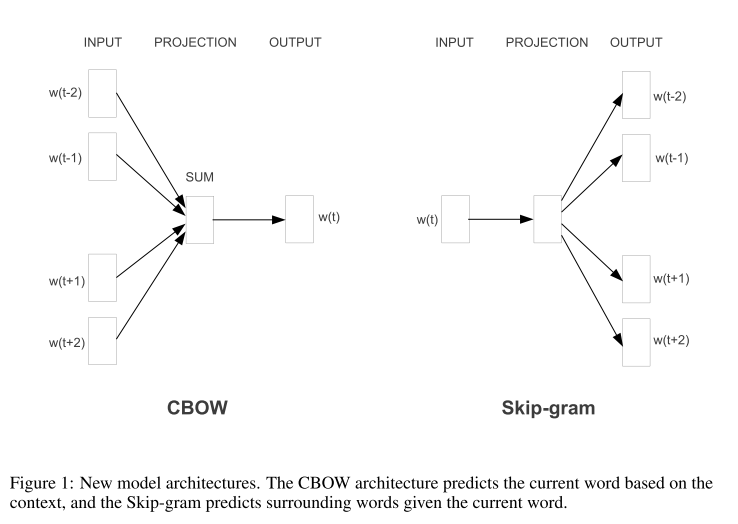

```{r setup, include=FALSE}
knitr::opts_chunk$set(echo = FALSE)
library(reticulate)
library(quanteda)
library(lexicon)
use_virtualenv("~/software/py39")
library(dplyr)
library(ggplot2)
```


```{python include=FALSE}
import math
```

# Objectives

## Objectives

By now we have figured out how to **represent** texts using the "bag of words" model.

Today we will look at **word embeddings**, which are a basic building block for understanding much of much modern NLP. 

# Word embeddings

## Why do we need word embeddings?

With the bag of words model, there are as many columns as there are unique words, and each column is completely independent.

Consider the following two texts

```
"The acclaimed author penned novels based on her life"

"Nobel prize-winning writer writes autobiographical fiction"
```

Are they similar? Would an bag of words model consider these similar texts?

## Word similarity

Words themselves can be similar. A richer model will represent this similarity.

If this works, then the sentence

The **cat** sat on the mat.

will be much more similar to the sentence

The **dog** sat on the mat.

than it will be to the sentence

The **carbon** sat on the mat.

## How can we find similar words

The intuition is that similar words appear in similar contexts

## Word embeddings

[Mikolov et al, 2013](https://arxiv.org/abs/1310.4546) developed a very efficient way to learn word embeddings for very large vocabularies.

\medskip
Essentially, neural networks are trained on huge corpora to predict words from context (Continuous Bag of Words - CBOW) or context from words (Skip-gram)

:::::: {.cols data-latex=""}

::: {.col data-latex="{0.6\textwidth}"}



:::

::: {.col data-latex="{0.003\textwidth}"}

\ 

:::

::: {.col data-latex="{0.4\textwidth}"}

from the sentence

\medskip

```
the cat sat on the mat
```

\medskip

we would have the following context, target pairs to predict

\medskip
	
`([cat sat], the), ([the, sat, on], cat), ([the, cat, on, the], sat), ([cat, sat, the, mat], on), ([sat, on, mat], the), ([on, the], mat)`

:::

::::::

## What do we learn?

The outcome of this learning is a vector representation of each word in `n` dimensions.

For example, if we learnt 3-dimensional embeddings on a corpus of documents, we might represent `cat` as `[0.3, 0.4, 0.6]`, `dog` as `[0.3, 0.42, 0.58]`, and `carbon` as `[0.5, -0.8, -0.1]`.

How would we calculate the similarity of these?

## Glove Embeddings

[Glove](https://nlp.stanford.edu/projects/glove/) embeddings are trained on large Corpora (wikipedia, twitter, common crawl (loads of web data)).

We can load these pre-trained embeddings. Let's have a look at some of our words.

\medskip
\scriptsize

```{r echo=TRUE, message=FALSE, cache=TRUE}
library(textdata)
library(coop)

N_DIM <- 100
glove <- embedding_glove6b(dimensions=N_DIM, dir="embeddings")
word_matrix <- as.matrix(glove[,-1])
rownames(word_matrix) <- glove$token
words <- word_matrix[c("dog","cat","carbon"),]

words[,1:5]

```

Have a look at some words for yourself and identify their similarity in the embedding space. Do they represent meaningful distances?

## Similarity with Glove Embeddings

Since each word is simply a vector, we can easily compute a similarity matrix of the words.

\medskip
\scriptsize

```{r echo=TRUE, message=FALSE, cache=TRUE}

words <- word_matrix[c("dog","cat","carbon"),]
sims <- cosine(t(words))
sims

```

Have a look at some words for yourself and identify their similarity in the embedding space. Do they represent meaningful distances?

## Glove Embeddings in Python

\scriptsize

```{python echo=TRUE, message=FALSE, cache=FALSE}
import pandas as pd
import csv
from zipfile import ZipFile
N_DIMS = 100
z = ZipFile("embeddings/glove6b/glove.6B.zip")
f = z.open(f'glove.6B.{N_DIMS}d.txt')
word_matrix = pd.read_table(
    f, sep=" ", index_col=0, 
    header=None, quoting=csv.QUOTE_NONE
)
from sklearn.metrics.pairwise import cosine_similarity
word_list = ["dog","cat","carbon"]
sims = pd.DataFrame(cosine_similarity(word_matrix.loc[word_list]))
sims.index, sims.columns = word_list, word_list
sims

```

## Comparing two word vectors

We can compare two vectors using the `cosine()` function from the [https://cran.r-project.org/web/packages/coop/index.html](coop) library.

\medskip

```{r echo=TRUE, message=FALSE}
library(coop)
vec_a <- word_matrix["paris",] 
vec_b <- word_matrix["france",] 
cosine(vec_a, vec_b)
```
## Comparing two word vectors in python

Similarly, we just calculate 1 - the cosine distance from [scipy.spatial.distance](https://docs.scipy.org/doc/scipy/reference/generated/scipy.spatial.distance.cosine.html)

\medskip

```{python echo=TRUE, message=FALSE}
from scipy.spatial.distance import cosine
vec_a = word_matrix.loc["paris"]
vec_b = word_matrix.loc["france"]
1 - cosine(vec_a, vec_b)
```

## Unrelated words

In pairs, one person starts by suggesting any word. The other pair member should come up with as dissimilar a word as possible. Continue with a word dissimilar to that. Note down your list of words and their similarity.

## Finding similar words

If we want to find words that are similar to other words, then we can compare the vector for our target word with the vector for each other word.

\medskip

\scriptsize

```{r echo=TRUE, message=FALSE}

vec_a <- word_matrix["cat",] 
sims <- apply(word_matrix, 1, function(x) cosine(x,vec_a))
sims %>% sort(decreasing=T) %>% head()

```
Conversely, we can also find dissimilar words, which can have a similarity < 0

```{r echo=TRUE, message=FALSE}

sims %>% sort(decreasing=F) %>% head()

```

## A function to find any word's neighbours

If we want to do this for a few different words, we might decide we don't want to write this code out every time. Let's build a function to do it for us

\medskip

\scriptsize

```{r echo=TRUE, message=FALSE, cache=TRUE}

similar_words <- function(word, word_matrix) {
  vec_word <- word_matrix[word,]
  sims <- apply(word_matrix, 1, function(x) cosine(x,vec_word))
  return(sort(sims, decreasing=T))
}

similar_words("carbon", word_matrix) %>% head()

```
## A python function to find any word's neighbours

If we want to do this for a few different words, we might decide we don't want to write this code out every time. Let's build a function to do it for us

\medskip

\scriptsize

```{python echo=TRUE, message=FALSE, cache=TRUE}

# function for similar words to x
def similar_words(word, word_matrix):
    vec_a = word_matrix.loc[word]
    sims = 1 - word_matrix.apply(cosine, axis=1, args=(vec_a,))
    return sims.sort_values(ascending=False)

similar_words("carbon",word_matrix).head(6)

```


## Encoded Linguistic Regularities and Patterns

Embedding spaces encode interesting regularities and patterns. If we subtract vector B from vector A, we get a vector that represents the *relationship* of those vectors. 

If we subtract this vector from *another* vector C, we apply the same transformation, and get a vector D which is to C what B is to A. We can then find words which are close to D.

\medskip

\scriptsize
```{r echo=TRUE, message=FALSE, cache=TRUE}

diff <- word_matrix["paris",]  - word_matrix["france",] 
vec_d <- word_matrix["berlin",] - diff
sims <- apply(word_matrix, 1, function(x) cosine(x,vec_d))
sims %>% sort(decreasing=T) %>% head()

```

\medskip
\normalsize
Try out some other analogies ! 

## Analogies in Python

\scriptsize
```{python echo=TRUE, message=FALSE, cache=TRUE}

diff = word_matrix.loc["paris"] - word_matrix.loc["france"] 
vec_d = word_matrix.loc["berlin"] - diff
sims = 1 - word_matrix.apply(cosine, axis=1, args=(vec_d,))
sims.sort_values(ascending=False).head(6)

```

## Bias

Not all linguistic regularities and patterns are desirable. 

```{r }
words <- word_matrix[c("john","jane","doctor","nurse"),]
sims <- cosine(t(words))
sims
```
Pre-trained word vectors encode historic and present biases (in particular racism and sexism) in how humans have used languages.

How this affects us depends on our application, but we should be particularly cautious when the application has the potential to *amplify* biases.

Start from [stochastic parrots](https://dl.acm.org/doi/10.1145/3442188.3445922) to explore more on bias, risk, and harms in NLP.

## Polysemy

What words would be good neighbours for the word "flies"?

\bigskip

\only<2->{soars, flew, plane; or spider, bug, insect?}

\only<3->{Each token has only one position in the embedding space regardless of how many senses it has}

## Learning our own embeddings

Word embeddings available online encode information about how words are used in the context of the training dataset.

We may care about how words are used in a *specific* context, in which case it may make sense to learn our own embeddings.

This usually makes sense when you have large numbers of documents. Check out [text2vec](https://text2vec.org/glove.html) for how to do this.

We may even care about how word use differs between subgroups (i.e. what terms are close to immigration in the Republican vs. Democrat space?). Check out [Arthur Spirling's](https://github.com/prodriguezsosa/EmbeddingRegression/blob/main/Explainer/explainer.md) work on this.


# Document Embeddings

## Documents

Lets work out how to use embeddings to represent documents, and see if they are any good. We'll use our example documents from before, and put these into a document-feature matrix, and work out their similarity.

\medskip

\scriptsize

```{r echo=TRUE, message=FALSE}
docs <- c(
  "The acclaimed author penned novels based on her life",
  "Nobel prize-winning writer writes autobiographical fiction"
)
dfmat <- docs %>% tokens(remove_punc=TRUE) %>%
  tokens_remove(pattern=stopwords("en")) %>%
  dfm() 

print(cosine(as.vector(dfmat[1,]), as.vector(dfmat[2,])))

dfmat


```
\normalsize
\medskip

As we suspected, the texts' similarity in this space is 0

## Common features

Let's now find the words that are used in the document feature matrix, and the words that are in our embedding vocabulary, and select the parts of each matrix that uses these words. For simplicity first of all, we will select only the first 5 dimensions of the embedding space, and 4 features. We will also round the vectors to 1 decimal place

\medskip

\scriptsize

```{r echo=TRUE, message=FALSE}

common_features <- intersect(colnames(dfmat),rownames(word_matrix))
common_features <- c("author","novels","writer","writes")

glove_dfmat <- dfmat[,common_features]
print(glove_dfmat)
corpus_word_matrix <- round(word_matrix[common_features,1:5],1)
print(corpus_word_matrix)
```

## Summing 

We want a score in each dimension, for each document.

We can achieve this by taking the inner product of the two matrices.

This means summing the d1 scores for each occurrence of each word in a document, then doing the same for d2, d3, etc.

\medskip

\scriptsize

```{r echo=TRUE, message=FALSE}
doc_matrix <- glove_dfmat %*% corpus_word_matrix
doc_matrix
```

## Unsimplifying

Now we'll repeat this process but with the full feature set and the full set of dimensions

\medskip

\scriptsize

```{r echo=TRUE, message=FALSE}

common_features <- intersect(colnames(dfmat),rownames(word_matrix))

glove_dfmat <- dfmat[,common_features]
corpus_word_matrix <- word_matrix[common_features,]
doc_matrix <- glove_dfmat %*% corpus_word_matrix
print(cosine(doc_matrix[1,], doc_matrix[2,]))
```

\medskip

\normalsize

The cosine similarity of these documents in the embedding space is very high, even though they share no words in common!

## Embedding documents in python

Embedding documents in python works exactly the same

\medskip

\scriptsize

```{python echo=TRUE, message=FALSE}
from sklearn.feature_extraction.text import CountVectorizer
import numpy as np
docs = [
  "The acclaimed author penned novels based on her life",
  "Nobel prize-winning writer writes autobiographical fiction"
]
vec = CountVectorizer()
dfmat = vec.fit_transform(docs).todense()

common_features = set(word_matrix.index) & set(vec.get_feature_names_out())
vocab_ids = [vec.vocabulary_[x] for x in common_features]
doc_matrix = dfmat[:,vocab_ids].dot(word_matrix.loc[common_features,])
1 - cosine(doc_matrix[0,], doc_matrix[1,])
```

\medskip

\normalsize

The cosine similarity of these documents in the embedding space is very high, even though they share no words in common!

## Embedded manifestos

Now let's try embedding our manifesto sentences and reducing the dimensionality.

# Wrapup and Outlook

## Wrapup

\begin{itemize}
  \item<1->Word embeddings form our first encounter with \textit{fancy} NLP.
  \item<2->We can place words, \textit{and documents}, in a multidimensional embedding space.
  \item<3->This space \textit{encodes} \textbf{abstract} but \textbf{meaningful} information about language
  \item<4->Encoding texts in this space allows us to do a \textbf{better job} at \textit{some} tasks
\end{itemize}


## Outlook

\begin{itemize}
  \item<1->No class next week!
  \item<2->You will receive your homework grade over the course of next week.
  \item<3->In two weeks time, we will go into \textit{topic modelling}, on which there will be another assignment. Come to the class prepared by doing the  \href{http://www.cs.columbia.edu/~blei/papers/Blei2012.pdf}{reading}
  \item<4->Please fill out this informal midterm evaluation \href{https://docs.google.com/forms/d/e/1FAIpQLSf3W4erny4OmLh8cFIocRIL0epzCn9D0NF66gAboNU3aI1uhg/viewform?usp=sf_link}{link}
\end{itemize}


